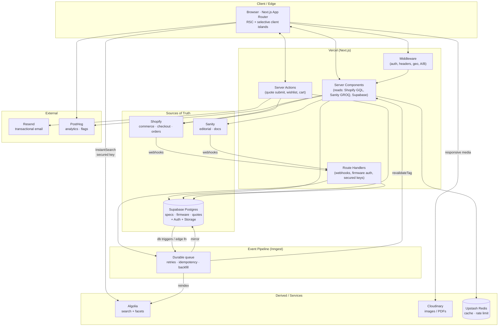
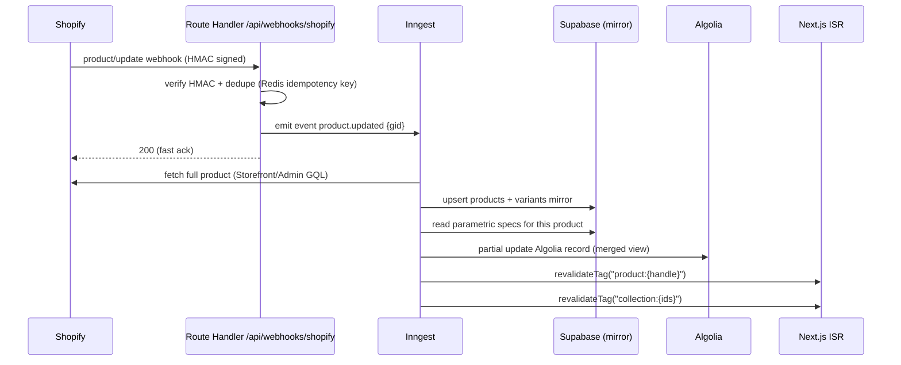
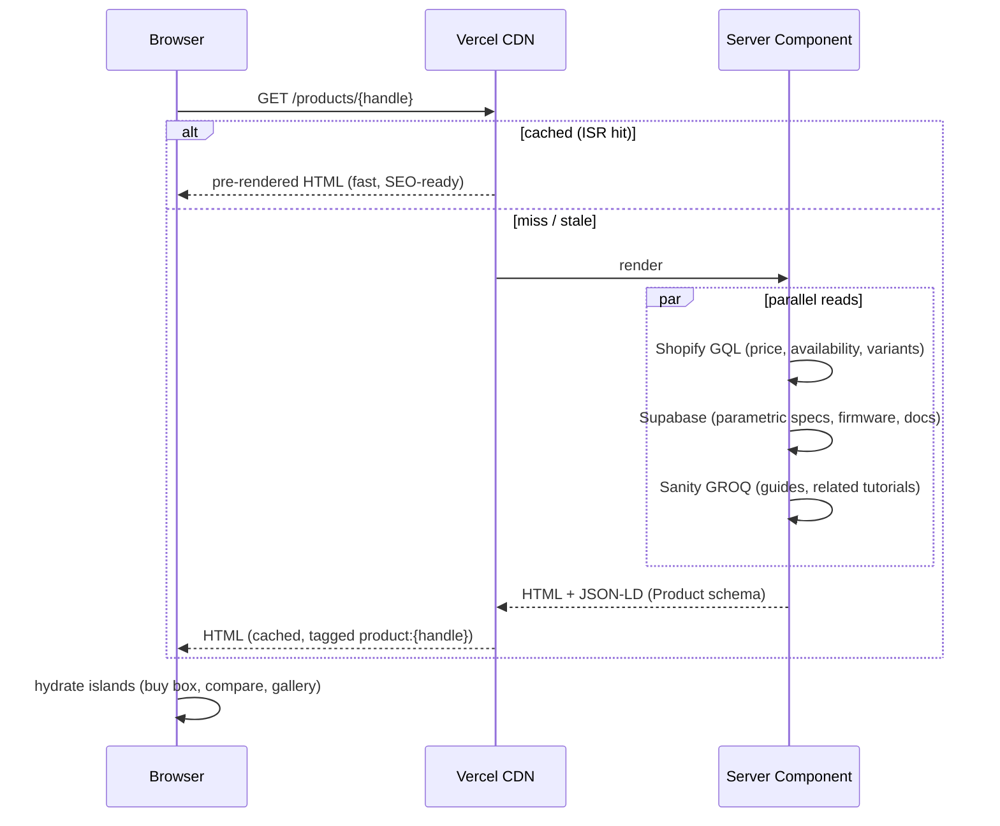
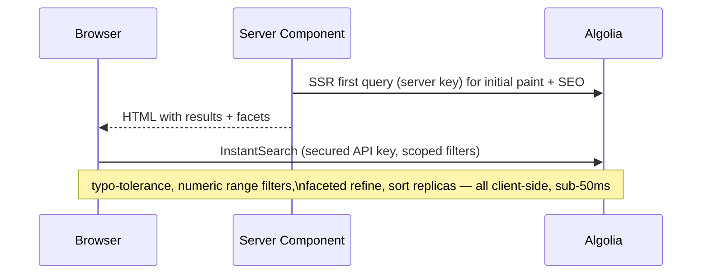
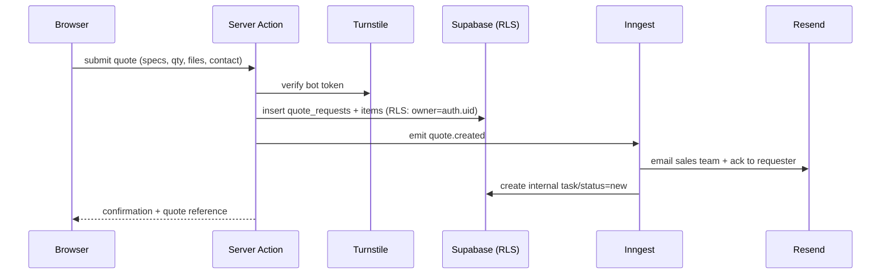
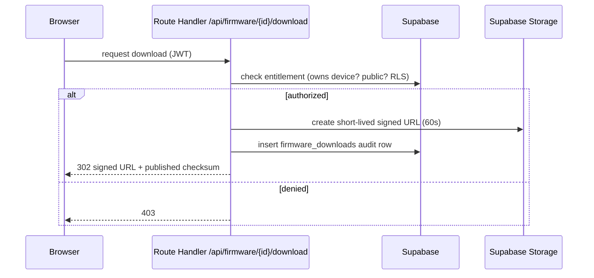
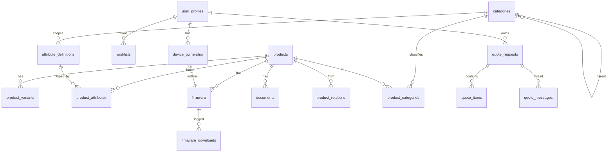

# Electronics Commerce Platform — Technical Architecture

> Status: v1 architecture blueprint. Owner: Platform/Architecture.
> Scope: 10,000+ SKUs, consumer electronics + custom devices, engineered for 100k+.

> **Locked decisions (2026-07-22):** Auth = Supabase Auth · Extra services (Inngest, Upstash Redis, Turnstile+Vercel WAF, reviews app, Sentry) = all approved · B2B = consumer-first, seams designed but seats/price-lists/net-terms deferred (stay on standard Shopify until B2B is built; Plus at that point).

---

## 1. Guiding principles

1. **Every data domain has exactly one source of truth.** Sync flows one direction from it. Ambiguous ownership is the #1 failure mode of multi-service commerce stacks — we design it out.
2. **Buy, don't build.** Checkout, payments, tax, search, media, auth, email — all delegated to specialists. We write *glue and differentiation*, not infrastructure.
3. **Static-first, revalidate on change.** Pages are pre-rendered and served from CDN; content changes push targeted invalidations. We never block a user render on a live third-party API where it can be avoided.
4. **The relational database is for what's relational.** Parametric specs, firmware, entitlements, quotes, and cross-references live in Postgres — the things Shopify metafields and Sanity documents model badly at scale.
5. **Event-driven, idempotent sync.** All cross-system propagation goes through a durable, retryable queue. No critical work runs "inline" inside a webhook handler.

---

## 2. Key decisions & tradeoffs

### 2.1 Source-of-truth map (the most important decision)

| Data domain | Source of truth | Why | Mirrored/indexed to |
|---|---|---|---|
| Price, inventory, variants, cart, checkout, orders, tax, discounts | **Shopify** | PCI/tax/payments are solved problems; never rebuild | Supabase mirror (for joins), Algolia (display) |
| Editorial: tutorials, guides, docs, manuals text, marketing, category copy | **Sanity** | Structured rich content + editorial workflow | Algolia (searchable content) |
| Parametric/technical specs, taxonomy, firmware, quotes, entitlements, cross-refs | **Supabase Postgres** | Relational, filterable, RLS-governed | Algolia (facets) |
| Search & faceted filtering read model | **Algolia** (derived) | Denormalized, never authored directly | — |
| Images, rendered PDFs, responsive media | **Cloudinary** | Transformations + CDN | referenced by URL everywhere |
| Firmware binaries, private files | **Supabase Storage** | Signed URLs + RLS-gated entitlement | — |
| Identity, sessions | **Supabase Auth** | Native RLS via `auth.uid()` | mapped to Shopify customer |

**Rule:** a field is authored in exactly one system. Algolia and the Supabase product-mirror are **derived read models** — never edited by hand.

### 2.2 Auth: Supabase Auth over Clerk

**Decision: Supabase Auth.** Our differentiators (firmware entitlements, quote ownership, saved comparisons, B2B pricing visibility) are all *rows in Postgres that must be access-controlled*. Supabase Auth issues a JWT that Postgres Row-Level Security consumes natively via `auth.uid()` — zero glue. Clerk has better DX and stronger org/B2B team management, but bridging Clerk → Postgres RLS requires custom JWT templates and keeps two identity systems in sync.

**Switch condition:** B2B is explicitly **consumer-first / deferred** — we design the seams (nullable `b2b_account_id`, role on `user_profiles`, `AuthProvider` interface) but do not build seats/price-lists now. If multi-seat B2B org management (invite flows, seat roles, SSO/SAML) later becomes first-class, migrate to Clerk and bridge to RLS as a contained swap. Shopify stays on a standard plan until then; upgrade to Plus when B2B ships.

**The three-identity problem:** app user (Supabase) ≠ Shopify customer ≠ Sanity author. We resolve it with a `user_profiles` table mapping `auth.uid()` → `shopify_customer_id`, created lazily on first checkout/account action via the Shopify Admin API.

### 2.3 Checkout: Shopify hosted checkout (not custom)

Redirect to Shopify's hosted/managed checkout. This offloads **all** PCI scope, fraud, tax calculation, and payment methods. We own the cart experience (Storefront API), Shopify owns the money. Checkout branding/extensibility via Shopify Checkout Extensions. *Cost of custom checkout = PCI-DSS SAQ-D + fraud liability. Not worth it.*

### 2.4 Additions beyond the given stack — **APPROVED**

Proven services that remove real risk. All approved for inclusion (2026-07-22):

| Add | Purpose | Alternative |
|---|---|---|
| **Inngest** (or Upstash QStash) | Durable, retryable, observable sync/event pipeline. **Non-negotiable** for reliable Shopify↔Supabase↔Algolia sync. | Roll your own queue = reinventing at-least-once delivery |
| **Upstash Redis** | Rate limiting, hot cart/session cache, webhook idempotency keys | Vercel KV |
| **Cloudflare Turnstile** + **Vercel WAF/Firewall** | Bot protection on quote forms, search, auth | reCAPTCHA |
| **Judge.me / Okendo** (Shopify app) | Product reviews — don't build a reviews system | custom |
| **Sentry** | Error tracking across serverless + client | — |

### 2.5 Shopify plan note

Headless via Storefront API works on standard plans, but **Shopify Plus** is likely warranted for: B2B catalogs/price lists, higher API rate limits at 10k+ SKUs, checkout extensibility, and expansion stores. Budget for it as catalog and B2B needs grow.

---

## 3. System architecture



### Service responsibilities

| Service | Owns | Does NOT own |
|---|---|---|
| **Next.js / Vercel** | Rendering, routing, SEO, orchestration, BFF-thin API, auth middleware | Business data authoring |
| **Shopify** | Catalog commerce state, cart, checkout, orders, payments, tax, discounts, customers | Technical specs, editorial, search UX |
| **Sanity** | Tutorials, guides, docs, manual copy, marketing/landing, category descriptions | Prices, inventory, filtering |
| **Supabase Postgres** | Parametric specs, taxonomy + attribute schema, firmware metadata, quotes, entitlements, cross-refs, product mirror | Payments, editorial rich text |
| **Supabase Auth** | Identity, JWT, RLS subject | Commerce customer record (Shopify) |
| **Supabase Storage** | Firmware binaries, gated files | Public marketing media |
| **Algolia** | Search, autocomplete, faceted filtering, ranking, merchandising | Authoritative data (read model only) |
| **Cloudinary** | Image/PDF storage, transforms, responsive delivery, CDN | Access-gated binaries |
| **Inngest** | Durable event routing, retries, backfills, idempotency | Business logic authoring |
| **Resend** | Transactional email (quotes, order-adjacent, firmware alerts) | Marketing automation (use Shopify/Klaviyo) |
| **PostHog** | Product analytics, funnels, feature flags, A/B, session replay | PII-heavy storage |
| **Upstash Redis** | Rate limiting, idempotency keys, hot cache | Durable data |

---

## 4. Data flows

### 4.1 Product sync (Shopify → mirror → Algolia → page invalidation)



Sanity publish and Supabase spec-edit follow the same shape: webhook/trigger → Inngest → rebuild the merged Algolia record + `revalidateTag`. **The Algolia record is always assembled from all three sources**, so any source changing triggers a re-merge.

### 4.2 Product detail page render (SEO-critical, static-first)



Live inventory is refreshed client-side in the buy-box island so the static shell stays cacheable while stock stays accurate.

### 4.3 Faceted search / category listing



### 4.4 Custom device quote request



### 4.5 Firmware download (entitlement-gated)



---

## 5. Rendering strategy (Next.js App Router)

| Route | Strategy | Rationale |
|---|---|---|
| Home, landing | ISR + on-demand revalidate (Sanity tag) | Editorial-driven, cacheable |
| `/products/[handle]` (PDP) | ISR, tag `product:{handle}`, revalidate on webhook | SEO + speed; static shell, live buy-box island |
| `/c/[...category]` (listing) | SSR first paint (Algolia server key) → client InstantSearch | Crawlable + interactive facets |
| `/search` | Client InstantSearch, SSR shell | Interaction-heavy |
| `/compare` | Client component, data from Supabase/Algolia | Session/user state |
| `/learn/*` (tutorials/docs) | SSG/ISR from Sanity | Content, SEO gold (Adafruit/iFixit model) |
| `/account/*`, `/quotes/*` | Dynamic, auth-gated (no cache) | Per-user, RLS |
| Cart | Client island + Server Action | Live commerce state |

**SEO backbone:** RSC-rendered HTML, `generateMetadata` per route, JSON-LD (`Product`, `BreadcrumbList`, `FAQPage`, `TechArticle`), dynamic `sitemap.ts` (products from mirror, content from Sanity), canonical URLs, Cloudinary responsive images with correct dimensions to protect CLS/LCP.

---

## 6. Database design (Supabase Postgres)



### Key tables (abridged DDL intent)

```sql
-- Identity bridge: app user <-> Shopify customer
user_profiles(
  id uuid pk = auth.uid(),
  shopify_customer_id text unique,     -- created lazily via Admin API
  company text, role text,             -- 'consumer' | 'b2b' | 'staff'
  b2b_account_id uuid null,
  created_at timestamptz
)

-- Derived mirror of Shopify (NEVER hand-authored)
products(
  id uuid pk,
  shopify_product_id text unique,      -- gid://shopify/Product/...
  handle text unique, title text,
  product_type text, vendor text,
  status text,                         -- active|draft|archived
  specs jsonb,                         -- canonical parametric values (GIN index)
  synced_at timestamptz
)
product_variants(
  id uuid pk, product_id uuid fk,
  shopify_variant_id text unique, sku text,
  price_snapshot numeric,              -- display only; Shopify authoritative
  attributes jsonb
)

-- Taxonomy + parametric schema (Digi-Key/Mouser style)
categories(id uuid pk, parent_id uuid null fk, slug text, name text, path ltree)
attribute_definitions(
  id uuid pk, category_id uuid fk,
  key text, name text, unit text,
  data_type text,                      -- number|enum|bool|text|range
  filterable bool, comparable bool, display_group text, sort int
)
product_attributes(                    -- typed EAV for admin/reporting; Algolia does the filtering UX
  product_id uuid fk, attribute_id uuid fk,
  value_num numeric, value_text text, value_bool bool,
  primary key (product_id, attribute_id)
)

-- Support content / manuals metadata (bodies in Sanity/Cloudinary)
documents(
  id uuid pk, product_id uuid fk,
  type text,                           -- manual|datasheet|cert|cad
  title text, url text, language text, version text, published_at timestamptz
)

-- Firmware
firmware(
  id uuid pk, product_id uuid fk,
  version text, semver text, channel text,     -- stable|beta
  storage_path text, checksum_sha256 text, size_bytes bigint,
  min_hardware_rev text, requires_entitlement bool default false,
  release_notes_ref text, is_public bool, published_at timestamptz
)
firmware_downloads(id uuid pk, firmware_id uuid fk, user_id uuid null, ip inet, at timestamptz)
device_ownership(user_id uuid fk, product_id uuid fk, serial text, registered_at timestamptz)

-- Quotes (custom devices)
quote_requests(
  id uuid pk, user_id uuid null, reference text unique,
  company text, contact_email text, status text,   -- new|reviewing|quoted|won|lost
  created_at timestamptz
)
quote_items(id uuid pk, quote_id uuid fk, description text, product_ref uuid null,
            quantity int, target_price numeric, specs jsonb, attachments jsonb)
quote_messages(id uuid pk, quote_id uuid fk, author uuid, body text, at timestamptz)

-- Relationships powering compare / recommend / compatibility
product_relations(
  from_product uuid fk, to_product uuid fk,
  relation_type text,                  -- accessory|compatible|alternative|upgrade|frequently_bought
  weight numeric, primary key(from_product, to_product, relation_type)
)
wishlists(id uuid pk, user_id uuid fk, product_id uuid fk, added_at timestamptz)
```

> **Refined in [DATA-MODEL.md](./DATA-MODEL.md):** the normalized attribute rows are the *canonical* store and `products.specs` JSONB is a *generated projection* — see that doc for the full flexible-attribute design.

**Why JSONB `specs` + `attribute_definitions` (not pure EAV):** Algolia handles the *filtering UX*, so Postgres doesn't need to serve high-QPS parametric queries. JSONB (GIN-indexed) gives flexible per-category schemas without table sprawl; `attribute_definitions` provides the typed schema that drives (a) admin validation, (b) the compare table layout, and (c) which facets Algolia builds. `product_attributes` typed EAV is kept for reporting/joins where JSONB is awkward.

### Row-Level Security (enforced in DB, not app)

```sql
-- users see only their own quotes
create policy quote_owner on quote_requests
  for all using (user_id = auth.uid());
-- firmware: public OR entitled via owned device
create policy fw_read on firmware for select using (
  is_public or exists (
    select 1 from device_ownership d
    where d.user_id = auth.uid() and d.product_id = firmware.product_id));
-- product mirror & taxonomy: public read, service_role write only
```

**Serverless connection management:** all app queries go through **Supavisor (transaction pooling)** — serverless functions must never hold direct Postgres connections. `service_role` key is server-only (webhooks/Inngest); the browser and RSC use the anon key + RLS.

---

## 7. API strategy

**Principle: thin BFF. Read directly from sources in RSC; add API surface only where security or orchestration demands it.**

| Concern | Mechanism |
|---|---|
| Product/content reads | Direct in Server Components — Shopify Storefront GraphQL, Sanity GROQ, Supabase (RLS) |
| Mutations (quote, wishlist, cart, register device) | **Server Actions** (typed, CSRF-safe, colocated) |
| Webhooks (Shopify, Sanity) | **Route Handlers** + HMAC verify + Inngest emit |
| Firmware authorization | Route Handler (entitlement check → signed URL) |
| Algolia secured keys | Route Handler mints scoped, short-TTL search keys per user |
| Cart token proxy | Route Handler / Action to keep Storefront tokens server-side |
| Background work | **Inngest functions** (reindex, emails, backfills) |

- **GraphQL** where the provider is GraphQL-native (Shopify, Sanity-as-GraphQL optional); **GROQ** for Sanity; typed SDKs elsewhere. We do **not** stand up our own GraphQL gateway — unnecessary custom infrastructure.
- Everything is **typed end-to-end**: Shopify codegen, `sanity typegen`, Supabase generated types, Zod at Action boundaries.
- **Idempotency** on all webhook/queue consumers (Redis key = event id).

---

## 8. Search architecture (Algolia)

- **One primary index** `products` with **replicas** for each sort order (price asc/desc, newest, popularity) — Algolia ranks per replica.
- **Record = merged read model**: commerce (price/availability from Shopify) + parametric facets (Supabase) + boosted keywords (Sanity). Rebuilt by Inngest on any-source change.
- **Facets** derived from `attribute_definitions.filterable` — numeric ranges (voltage, capacitance, tolerance), hierarchical category facet (`ltree` → Algolia hierarchical facet), boolean/enum. This is the Digi-Key/Mouser parametric experience.
- **Merchandising & ranking**: business rules (promote in-stock, pin sponsored, bury EOL) via Algolia Rules — no code deploys.
- **Recommendations**: Algolia Recommend (frequently-bought, related, trending) seeded by `product_relations` + PostHog events; complements the relational cross-refs.
- **Security**: browser uses a **secured API key** (scoped filters, e.g. hide B2B-only SKUs from anonymous users), minted server-side; the Admin key never leaves the server.

---

## 9. Security considerations

- **Secrets**: all in Vercel env (server scope). Public-safe only in `NEXT_PUBLIC_*` (Storefront token, Algolia search key, PostHog key, Cloudinary cloud name).
- **Key discipline**: Shopify Admin token, Algolia Admin key, Supabase `service_role`, Sanity write token → **server-only**, used solely in Route Handlers / Inngest.
- **RLS everywhere** on user-owned data — the DB is the last line of defense, independent of app bugs.
- **Firmware**: entitlement check → 60s signed URL → audit log → published SHA-256 checksum so users verify integrity. Never a public bucket.
- **Webhooks**: HMAC signature verification (Shopify), signed secrets (Sanity), replay protection via idempotency keys.
- **Bot/abuse**: Turnstile on quote/auth/high-cost search; Vercel WAF rate limits; Upstash rate limiting per IP/user on Actions.
- **Headers**: strict CSP (allowlist Cloudinary/Algolia/PostHog/Shopify), HSTS, `X-Content-Type-Options`, Referrer-Policy — via middleware.
- **PII**: quotes carry B2B contact data — minimize, RLS-scope, avoid sending to PostHog; DSAR/erasure path defined.
- **PCI**: fully offloaded to Shopify hosted checkout (SAQ-A posture).
- **Supply chain**: pinned deps, Dependabot, `npm audit` in CI, SRI where applicable.

---

## 10. Scaling strategy

| Layer | 10k SKUs today | Path to 100k+ |
|---|---|---|
| Pages | Vercel CDN + ISR, tag invalidation | Same; ISR scales with catalog, only changed pages rebuild |
| Search | Algolia (sub-50ms, millions of records) | Native; add replicas/analytics |
| Postgres | Supavisor pooling, GIN/btree indexes, `ltree` on taxonomy | Read replicas, partition audit tables (`firmware_downloads`) |
| Sync | Inngest concurrency + retries + backfill | Fan-out, batch reindex; full-reindex job for schema changes |
| Media | Cloudinary CDN, auto-format/quality, responsive | Native |
| Cart/session | Upstash Redis | Native |
| Observability | Sentry + PostHog + Vercel Analytics + Algolia + Inngest dashboards | SLOs, alerting |

**Design headroom:** nothing here is sized for 10k — every component comfortably handles 100k–1M records. The binding constraints at scale are **sync correctness** (solved by Inngest idempotency + periodic reconciliation job comparing Shopify/Supabase/Algolia) and **cache invalidation granularity** (solved by per-entity tags), not raw throughput.

---

## 11. Repository & environments

```
/apps/web            → Next.js app (App Router)
/apps/inngest        → event functions (or colocated /app/api/inngest)
/packages/shopify    → Storefront/Admin clients + codegen types
/packages/sanity     → schema, GROQ, typegen
/packages/db         → Supabase migrations, generated types, RLS policies
/packages/search     → Algolia indexing + record-merge logic
/packages/ui         → shared Tailwind component library
/packages/config     → eslint/ts/tailwind shared config
```

- **Monorepo** (Turborepo + pnpm) for shared types across services.
- **Environments**: Preview (per-PR Vercel) → Staging (sandbox Shopify/Sanity datasets) → Production. Supabase branching for DB previews.
- **CI**: typecheck, lint, unit, Playwright e2e on preview, migration check, `npm audit`.

---

## 12. Phased rollout

1. **Foundation** — monorepo, Supabase schema + RLS, Shopify connection, auth, base Next.js shell, CI/CD.
2. **Catalog & sync** — product mirror, Inngest pipeline, Algolia index + merge, PDP/listing with facets, SEO/JSON-LD/sitemap.
3. **Content & support** — Sanity (tutorials/docs), documents/manuals, Cloudinary media pipeline.
4. **Differentiators** — comparison, recommendations, firmware center (entitlements/downloads), quote workflow + Resend.
5. **Commerce polish** — cart/checkout, B2B pricing, reviews app, PostHog funnels/flags, merchandising rules.
6. **Hardening** — WAF/Turnstile, reconciliation job, SLOs/alerting, load test, security review.
