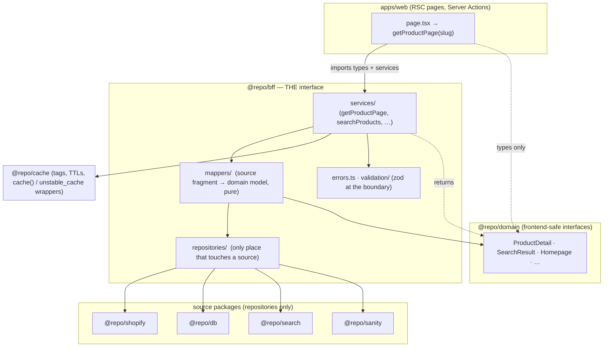
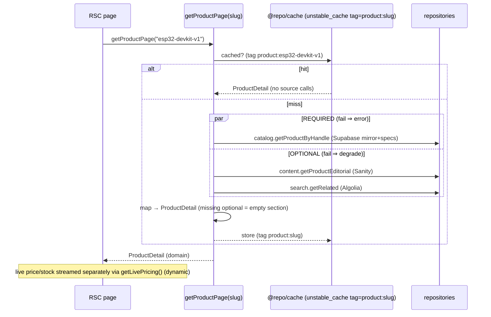

# Read-Side Architecture — The BFF Layer

> Phase 3 design. The **only** backend interface the Next.js frontend may use.
> Companions: [ARCHITECTURE.md](./ARCHITECTURE.md), [DATA-MODEL.md](./DATA-MODEL.md), [PRODUCT-PAGE.md](./PRODUCT-PAGE.md), [SEARCH.md](./SEARCH.md).

---

## 1. Principles & the hard boundary

1. **The frontend consumes typed domain services, nothing else.** A page calls `getProductPage(slug)` and receives one `ProductDetail`. It never learns that price came from Shopify, specs from Supabase, or tutorials from Sanity.
2. **No source shapes cross the boundary.** Shopify GraphQL objects, Supabase rows, Algolia records, and Sanity documents are *mapped* to domain models inside the BFF and never re-exported.
3. **One-way dependency.** `apps/web → @repo/bff → (sources)`. The web app may import `@repo/bff` and `@repo/domain` (types) — and **nothing else**.
4. **Enforced, not just documented.** `apps/web` ESLint bans importing source packages directly:

```js
// apps/web/eslint.config.js — no-restricted-imports
patterns: ["@repo/shopify", "@repo/db", "@repo/search", "@repo/sanity",
           "algoliasearch", "@supabase/*", "@sanity/*"]
```
A component that reaches for Algolia fails lint. That is what makes "the frontend never knows where data comes from" a guarantee rather than a hope.

---

## 2. Layering



**Four responsibilities inside `@repo/bff`:**
- **Repository** — the *sole* caller of a given source client; input = ids/queries, output = source-shaped fragments. One file per source.
- **Mapper** — pure functions: source fragment(s) → a domain model. No I/O. Trivially unit-testable.
- **Service** — the public function (`getProductPage`). Orchestrates repositories in parallel, calls mappers, applies caching + error handling. This is what `apps/web` calls.
- **Errors / validation** — typed error classes + Zod schemas that defensively parse external payloads (external data is untrusted input).

---

## 3. Data flow (getProductPage)



The **static, cacheable shell** is built from the Supabase mirror + Sanity + Algolia — **zero Shopify calls**. Live price/inventory is a *separate* dynamic service (`getLivePricing`) streamed into the buy box. This is how the read side survives millions of page views without hammering Shopify (see §8).

---

## 4. Folder structure & responsibilities

```
packages/
  domain/                     @repo/domain — frontend-safe interfaces ONLY (no deps, no logic)
    src/
      product.ts  search.ts  catalog.ts  account.ts  quote.ts  common.ts
      index.ts
  cache/                      @repo/cache — caching kernel
    src/
      tags.ts                 typed tag builders: productTag(handle), collectionTag(), …
      ttl.ts                  named TTL constants
      cached.ts               withCache() wrapper over unstable_cache + memo() over React cache()
      index.ts
  bff/                        @repo/bff — THE backend interface for the frontend
    src/
      index.ts                public API: the 11 services + type re-exports from @repo/domain
      errors.ts               NotFoundError, GoneError, DraftError, UpstreamError, PartialDataError
      support/
        settle.ts             required() / optional() helpers for graceful degradation
        money.ts              Money formatting, availability derivation
      validation/             zod schemas parsing external payloads (defensive)
      repositories/           the ONLY code that imports a source package
        catalog.repo.ts       Supabase reads (product, specs, category, brand, taxonomy)
        commerce.repo.ts      Shopify reads (live price/inventory, variants)
        search.repo.ts        Algolia reads (search, facets, recommend, related)
        content.repo.ts       Sanity reads (homepage, editorial, tutorials, docs)
        account.repo.ts       Supabase user-scoped reads (orders map, quotes, devices) via RLS
      mappers/                pure source-fragment → domain transforms
        product.mapper.ts  search.mapper.ts  home.mapper.ts  account.mapper.ts …
      services/               public functions (one concern per file)
        homepage.ts  navigation.ts  category.ts  brand.ts  product.ts
        search.ts  recommendations.ts  account.ts  quote.ts
    (tests colocated as *.test.ts)
apps/web/
  app/**                      pages call @repo/bff services in RSC (Phase 3+ UI)
  lib/supabase/*              request-scoped Supabase clients (already exist)
  actions/                    Server Actions (mutations) — Phase 4+
```

**Why 3 packages, not 6.** `repositories`, `mappers`, `services`, `contracts` share one dependency set, one release cadence, and only ever call each other in one direction — splitting them into separate packages adds workspace ceremony with no isolation benefit. They live as **folders inside `@repo/bff`** with a strict internal rule: *services→mappers→repositories*, and only `repositories/` may import a source package. `@repo/domain` (types) and `@repo/cache` (kernel) are separated because they have genuinely different consumers and dependency graphs.

---

## 5. Domain models (frontend-safe interfaces)

`@repo/domain` — pure types. Every field is display-ready; nothing leaks a source id the browser shouldn't see.

```ts
// common.ts
export interface Money { amount: number; currency: string; formatted: string }
export interface Image { url: string; alt: string; width: number; height: number; blurDataURL?: string }
export interface Breadcrumb { name: string; href: string }
export type Availability = "in_stock" | "low_stock" | "out_of_stock" | "backorder" | "preorder";
export interface Seo { title: string; description: string; canonical: string; ogImage?: string }

// catalog.ts
export interface Specification { key: string; label: string; value: string; unit?: string; isKeySpec: boolean }
export interface SpecificationGroup { name: string; specifications: Specification[] }
export interface ReviewSummary { average: number; count: number; distribution?: Record<1|2|3|4|5, number> }
export interface Facet {
  attribute: string; label: string; type: "list" | "range" | "hierarchical";
  values: FacetValue[];
}
export interface FacetValue { value: string; label: string; count: number; selected: boolean; min?: number; max?: number }

// product.ts
export interface ProductVariant {
  id: string; title: string; sku: string;
  options: Record<string, string>;        // {"Storage":"256GB"}
  price: Money; compareAtPrice?: Money;
  availability: Availability; leadTimeDays?: number;
}
export interface DocumentDownload {
  id: string; title: string;
  type: "manual" | "datasheet" | "cad" | "certificate" | "schematic";
  url: string; sizeLabel?: string; language?: string; version?: string;
}
export interface TutorialPreview { title: string; slug: string; href: string; excerpt?: string; level?: string; coverImage?: Image }
export interface WarrantyInformation { durationLabel: string; summary: string; url?: string }
export interface Accessory { product: ProductSummary; note?: string }

export interface ProductSummary {                 // the card model (grid/rail/compare)
  id: string; handle: string; href: string;
  title: string; brand: string;
  image: Image | null;
  price: Money; compareAtPrice?: Money;
  availability: Availability;
  rating?: ReviewSummary;
  keySpecs: Specification[];                       // is_key_spec, ≤4
  badges?: string[];
}

export interface ProductDetail {
  id: string; handle: string; title: string; subtitle?: string;
  brand: { name: string; slug: string; logo?: Image };
  breadcrumbs: Breadcrumb[];
  gallery: Image[];
  price: Money; compareAtPrice?: Money;            // SNAPSHOT for SSR/SEO; live via getLivePricing()
  availability: Availability;
  variants: ProductVariant[];
  keyBenefits: string[];
  description?: RichText;                           // portable-text → safe blocks
  specificationGroups: SpecificationGroup[];
  documents: DocumentDownload[];
  compatibility: { label: string; href?: string }[];
  tutorials: TutorialPreview[];
  reviews: ReviewSummary;
  accessories: Accessory[];
  seo: Seo;
  isCustom: boolean;                               // → quote flow instead of add-to-cart
}
export type RichText = Array<{ type: string; text?: string; children?: RichText }>; // opaque, renderer-owned

// live pricing (dynamic, streamed into the buy box)
export interface LivePricing {
  variants: Array<{ id: string; price: Money; compareAtPrice?: Money; availability: Availability; quantityAvailable: number }>;
  updatedAt: string;
}

// search.ts
export interface AppliedFilter { attribute: string; label: string; value: string }
export interface Pagination { page: number; pageSize: number; total: number; totalPages: number; hasNext: boolean; hasPrev: boolean }
export type SortOption = "relevance" | "price_asc" | "price_desc" | "newest" | "popularity";
export interface SearchResult {
  query?: string;
  items: ProductSummary[];
  facets: Facet[];
  appliedFilters: AppliedFilter[];
  pagination: Pagination;
  sort: SortOption;
}
export interface Recommendation { product: ProductSummary; reason?: string }
export interface RelatedProduct { product: ProductSummary; relationship: "accessory" | "alternative" | "compatible" | "frequently_bought" }

// catalog pages
export interface CategoryTile { name: string; slug: string; href: string; image?: Image; productCount?: number }
export interface BrandTile { name: string; slug: string; href: string; logo?: Image }
export interface CategoryPage {
  category: { name: string; slug: string; description?: RichText };
  breadcrumbs: Breadcrumb[];
  facets: Facet[];
  initial: SearchResult;                           // SSR first page for SEO
  seo: Seo;
}
export interface BrandPage {
  brand: { name: string; slug: string; logo?: Image; description?: RichText };
  breadcrumbs: Breadcrumb[];
  featured: ProductSummary[];
  initial: SearchResult;
  seo: Seo;
}

// homepage & navigation
export interface Homepage {
  hero: { headline: string; subl:string; image?: Image; cta: { label: string; href: string }[]; specChips?: string[] };
  featuredCategories: CategoryTile[];
  trending: ProductSummary[];
  newArrivals: ProductSummary[];
  customSolutions: { headline: string; body: string; href: string };
  educational: TutorialPreview[];
  brands: BrandTile[];
  seo: Seo;
}
export interface NavItem { label: string; href: string; children?: NavItem[] }
export interface MegaMenuColumn { heading: string; links: NavItem[] }
export interface MegaMenuSection { category: NavItem; columns: MegaMenuColumn[]; featured?: ProductSummary[] }
export interface Navigation { primary: NavItem[]; mega: MegaMenuSection[] }

// account & quotes
export interface OrderSummary {
  id: string; number: string; placedAt: string;
  status: "pending" | "processing" | "fulfilled" | "cancelled" | "refunded";
  total: Money; itemCount: number; trackingUrl?: string;
  items: { title: string; image: Image | null; quantity: number }[];
}
export interface QuoteLineItem { description: string; quantity: number; targetPrice?: Money; product?: ProductSummary }
export interface Quote {
  reference: string;
  status: "new" | "reviewing" | "quoted" | "negotiation" | "accepted" | "won" | "lost" | "cancelled";
  createdAt: string;
  items: QuoteLineItem[];
  latestQuote?: { total: Money; validUntil?: string; status: string };  // no internal notes/margins
}
export interface RegisteredDevice { productHandle: string; name: string; serial?: string; registeredAt: string; warranty?: WarrantyInformation }
export interface CustomerDashboard {
  profile: { name: string; email: string; company?: string };
  orders: OrderSummary[];
  savedProducts: ProductSummary[];
  quotes: Quote[];
  downloads: DocumentDownload[];
  devices: RegisteredDevice[];
}
export interface RecentlyViewed { items: ProductSummary[] }
```

---

## 6. Data ownership (single source per property — no duplication)

| Domain field | Owner | Read via |
|---|---|---|
| `ProductDetail.title / subtitle / brand.name` | **Supabase** mirror (originated in Shopify) | catalog.repo |
| `ProductDetail.price` (snapshot) | **Supabase** mirror (`price_snapshot`, kept fresh by pipeline) | catalog.repo |
| `LivePricing.*` (authoritative price/stock) | **Shopify** | commerce.repo |
| `ProductDetail.availability / variants` | **Supabase** snapshot; live in `LivePricing` | catalog / commerce |
| `ProductDetail.gallery` | **Cloudinary** URLs stored in Supabase/Sanity | catalog / content |
| `ProductDetail.description / keyBenefits / tutorials / documents(manuals)` | **Sanity** | content.repo |
| `ProductDetail.specificationGroups` | **Supabase** (`product_specifications` + defs) | catalog.repo |
| `ProductDetail.compatibility` | **Supabase** (`compatibility`) | catalog.repo |
| `ProductDetail.documents(datasheet/cad)` | **Supabase** (`documents`) | catalog.repo |
| `ProductDetail.reviews` | **Supabase** mirror of reviews app | catalog.repo |
| `SearchResult.* / Facet.* / CategoryPage.initial` | **Algolia** | search.repo |
| `Recommendation / RelatedProduct` | **Algolia** (Recommend) + Supabase `product_relations` seed | search.repo |
| `Homepage.hero / educational / customSolutions` | **Sanity** | content.repo |
| `Homepage.trending / newArrivals` | **Algolia** | search.repo |
| `Navigation.*` | **Supabase** taxonomy + **Sanity** overrides | catalog / content |
| `OrderSummary.*` | **Shopify** (customer orders) | commerce.repo |
| `Quote.* / QuoteLineItem` | **Supabase** (RLS, owner-scoped) | account.repo |
| `CustomerDashboard.savedProducts / downloads / devices` | **Supabase** (RLS) | account.repo |

Each property has exactly one owner. Where two sources *could* provide a value (e.g. price), the table names the **canonical read path** and the rationale (cacheable snapshot vs live).

---

## 7. Service interfaces

```ts
// @repo/bff — the entire public surface
export function getHomepage(): Promise<Homepage>;
export function getNavigation(): Promise<Navigation>;
export function getCategoryPage(slug: string, params?: SearchParams): Promise<CategoryPage>;
export function getBrandPage(slug: string, params?: SearchParams): Promise<BrandPage>;
export function getProductPage(handle: string): Promise<ProductDetail>;          // throws NotFound/Draft/Gone
export function getLivePricing(handle: string): Promise<LivePricing>;             // dynamic, buy-box
export function searchProducts(params: SearchParams): Promise<SearchResult>;
export function getRecommendations(handle: string): Promise<Recommendation[]>;
export function getRelatedProducts(handle: string): Promise<RelatedProduct[]>;
export function getRecentlyViewed(handles: string[]): Promise<RecentlyViewed>;    // ids from cookie/client
export function getCustomerDashboard(): Promise<CustomerDashboard>;               // RLS: current user
export function getQuoteDetails(reference: string): Promise<Quote>;               // RLS: owner only

export interface SearchParams {
  query?: string; category?: string; brand?: string;
  filters?: Record<string, string[]>; range?: Record<string, [number, number]>;
  sort?: SortOption; page?: number; pageSize?: number;
}
```

Every function returns **one** domain object. Services throw typed errors (§9); pages map those to `notFound()` / error boundaries.

---

## 8. Cache strategy

Two mechanisms: **`cache()`** (React, per-request dedupe — e.g. `generateMetadata` + page both call `getProductPage`) and **`unstable_cache`** (cross-request, tag-invalidated). Wrapped in `@repo/cache` so services declare intent, not plumbing.

| Service | Mechanism | Tags | TTL / revalidation | Rendering |
|---|---|---|---|---|
| `getHomepage` | unstable_cache + cache() | `homepage`, `content` | 300s + on Sanity publish | ISR |
| `getNavigation` | unstable_cache + cache() | `navigation` | 3600s + on taxonomy change | static |
| `getCategoryPage` | unstable_cache | `category:{slug}`, `collection:all` | 300s + `collection:all` on any product change | ISR + client refine |
| `getBrandPage` | unstable_cache | `brand:{slug}`, `collection:all` | 300s | ISR |
| `getProductPage` | unstable_cache + cache() | **`product:{handle}`** | on-demand (pipeline `revalidateTag`) + 3600s fallback | ISR / PPR |
| `getLivePricing` | **none** (cache()-dedupe per request) | — | dynamic | streamed island |
| `searchProducts` | none (Algolia *is* the cache) | — | dynamic; SSR first page | client InstantSearch |
| `getRecommendations`/`getRelatedProducts` | unstable_cache | `product:{handle}`, `recs` | 3600s | streamed (Suspense) |
| `getRecentlyViewed` | none | — | dynamic (cookie/client ids) | client |
| `getCustomerDashboard` | **none** (`no-store`) | — | dynamic, per-user RLS | dynamic |
| `getQuoteDetails` | **none** (`no-store`) | — | dynamic, per-user RLS | dynamic |

**Tag alignment with Phase 2:** the pipeline already emits `revalidateTag(product:{handle})` and `collection:all`. `getProductPage` caches under `product:{handle}`; category/home under `collection:all` / `content`. So a product sync automatically invalidates exactly the pages that show it — the read and write sides are already wired together.

---

## 9. Error handling & graceful degradation

**Error classes** (`@repo/bff/errors.ts`): `NotFoundError` (404), `GoneError` (deleted → 410/404), `DraftError` (unpublished → 404 to public), `UpstreamError` (timeout/5xx from a source), `PartialDataError` (required data incomplete).

**Required vs optional composition** — the core of degradation:

```ts
const [core] = await required([catalog.getProductByHandle(handle)]);   // throws ⇒ error page
if (!core) throw new NotFoundError("product", handle);
if (core.status === "draft") throw new DraftError(handle);             // public 404
if (core.status === "archived") throw new GoneError(handle);

const [editorial, related] = await optional([                          // reject ⇒ default, page still renders
  content.getProductEditorial(handle),
  search.getRelated(handle),
], [EMPTY_EDITORIAL, []]);
```

| Scenario | Handling |
|---|---|
| **Not found** | `NotFoundError` → page calls `notFound()` |
| **Deleted product** | mirror `status=archived` → `GoneError` → 404 (+ optional redirect to category) |
| **Draft product** | `status=draft` → `DraftError` → 404 for public (visible only in preview) |
| **Out of stock** | not an error — `availability="out_of_stock"`, page renders, CTA adjusts |
| **Missing documentation/tutorials** | optional → empty array → section hidden |
| **Missing images** | mapper substitutes a placeholder `Image` (fixed dims → zero CLS) |
| **Partial data** | required present + optional degraded → render with gaps; log `PartialDataError` context |
| **Third-party timeout** | source clients already have timeouts/retries (Phase 2); optional sources degrade, required sources surface `UpstreamError` → error boundary with retry |

**Rule:** the product **core** (Supabase mirror + specs) is required; **Sanity editorial and Algolia recs are enhancements** — their failure degrades a section, never the page.

---

## 10. Performance design

- **Mirror-first reads** → the cacheable product/category/home paths make **zero Shopify calls**; Shopify is touched only by `getLivePricing` (dynamic, tiny, streamed). This is what scales to millions of views.
- **Parallel loading** → services fan out repositories with `Promise.all` (required) / `allSettled` (optional). No waterfalls.
- **`cache()` dedupe** → `getProductPage` called by `generateMetadata` and the page runs once per request.
- **`unstable_cache` + tags** → read-through cache; a warm product page hits neither DB nor Shopify. Invalidated precisely by the pipeline.
- **Algolia owns search/facets** → listing/search never query Postgres.
- **Streaming + PPR** → PDP static shell returns immediately; `getLivePricing` / `getRecommendations` stream into Suspense boundaries.
- **Lazy** → recs/related are separate services, fetched only when their island mounts.
- **Minimal DB queries** → `getProductByHandle` reads the denormalized `products.specs` projection + one specs join; category trail via the single-query ltree function (Phase 2 audit fix).

---

## 11. Testing plan (no live credentials)

- **Mappers** (pure) — exhaustive unit tests: `ProductDetail`, `ProductSummary`, `SearchResult`/facets, `Homepage`, account/quote. Given fixture source-fragments → assert domain output (incl. missing-image placeholder, empty-editorial degradation).
- **Services** — with mocked repositories: parallel composition, error mapping (NotFound/Draft/Gone), optional-degradation (reject → default), cache-key/tag selection.
- **Errors** — class hierarchy + status mapping.
- **Cache** — `withCache` calls `unstable_cache` with the right key/tags/TTL (mock next/cache).
- **Boundary guard** — a lint/test asserting no `@repo/domain` file imports a source package.

---

## 12. Implementation plan (within Phase 3, on approval)

1. `@repo/domain` — all interfaces above.
2. `@repo/cache` — tags, TTLs, `withCache`/`memo`.
3. `@repo/bff` errors + support (settle, money).
4. Repositories (catalog, commerce, search, content, account).
5. Mappers (+ unit tests).
6. Services (+ tests with mocked repos).
7. `apps/web` ESLint boundary rule.
8. Green gate: typecheck / lint / test / build.

No UI. The first page wiring (`app/products/[handle]/page.tsx` calling `getProductPage`) is the **start of Phase 3.5**, after this layer is approved and green.
