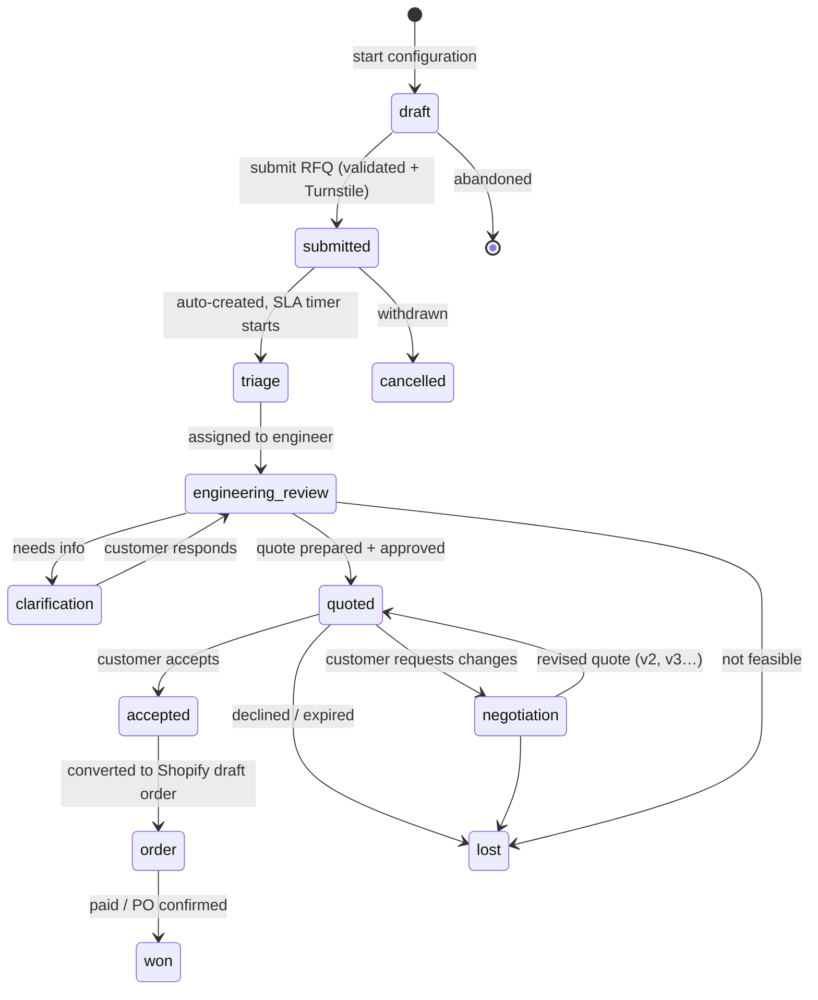

# Custom Electronics Device Workflow (RFQ / Configure-to-Order)

> Extends [DATA-MODEL.md](./DATA-MODEL.md) §8 (quotes) and [ARCHITECTURE.md](./ARCHITECTURE.md) §4.4 (quote flow).
> **B2B posture:** this workflow supports B2B customers via the `b2b_accounts` seam (company visibility, PO/net-terms fields). Full multi-seat org management (invites, seat roles, SSO) remains **deferred** per the locked decision — we build the seam, not the org tool.

This is not a contact form. It's a **configure-to-order RFQ engine**: the customer configures a device from a constrained option set, states manufacturing requirements, attaches engineering files, and receives an author-controlled quote that converts to a real order. The example — "Custom IoT gateway" — is a `config_template` with option groups (connectivity, power, enclosure, certifications…).

---

## 1. User flow — the quote state machine



Statuses map to `quote_status` (extended): `draft · submitted · triage · engineering_review · clarification · quoted · negotiation · accepted · order · won · lost · cancelled · expired`. Transitions are enforced server-side (§5) — a status can only move along allowed edges, every move is audited.

**Three entry personas**
- **Guest** — configures + submits with just email; a magic-link claims the quote into an account later. Removes the #1 RFQ friction (forced signup).
- **Consumer/maker** — logged in (Supabase Auth), quotes tied to `user_id`.
- **B2B buyer** — belongs to a `b2b_account`; all company members see company quotes (RLS), PO/net-terms/tax-exemption fields available.

---

## 2. Database model

Extends the existing quote tables (DATA-MODEL §8). New: configurator schema, B2B accounts, attachments, versions, line items, audit.

```sql
-- ── B2B account (the deferred-org SEAM: company grouping, not seat mgmt) ──
create table b2b_accounts (
  id            uuid primary key default gen_random_uuid(),
  name          text not null,
  tax_id        text,
  tax_exempt    boolean not null default false,
  net_terms     int,                          -- e.g. 30 (days); null = prepay
  credit_status text default 'unapproved',    -- unapproved|approved|hold
  default_shipping jsonb, default_billing jsonb,
  created_at    timestamptz not null default now()
);
-- users link to an account (lightweight; full seat roles deferred)
alter table user_profiles
  add column b2b_account_id uuid references b2b_accounts(id),
  add column b2b_role text;                    -- 'buyer' | 'approver' | 'admin' (seam)

-- ── Configurator (configure-to-order option system) ──────────────
create table config_templates (               -- a device family, e.g. "IoT Gateway"
  id uuid primary key default gen_random_uuid(),
  slug text unique, name text, summary text,
  hero_ref text,                               -- Sanity content
  base_unit_cost numeric(12,2), base_nre numeric(12,2),
  min_order_qty int default 1, lead_time_base_days int,
  is_active boolean default true
);
create type option_select as enum ('single','multi','numeric','boolean');
create table config_option_groups (
  id uuid primary key default gen_random_uuid(),
  template_id uuid references config_templates(id) on delete cascade,
  key text, name text,                         -- 'connectivity','power','enclosure','certs'
  select_type option_select not null,
  is_required boolean default false, sort int default 0
);
create table config_options (
  id uuid primary key default gen_random_uuid(),
  group_id uuid references config_option_groups(id) on delete cascade,
  key text, name text,                         -- 'lte_module','poe','din_rail','ip65'
  sku_hint text,
  unit_cost_delta numeric(12,2) default 0,     -- indicative pricing input
  nre_delta numeric(12,2) default 0,
  lead_time_delta_days int default 0,
  spec jsonb default '{}',                     -- reuses attribute keys (DATA-MODEL §4)
  sort int default 0, is_active boolean default true
);
-- compatibility/constraint engine between options
create type rule_kind as enum ('requires','excludes','implies','min_qty','max_qty');
create table config_rules (
  id uuid primary key default gen_random_uuid(),
  template_id uuid references config_templates(id) on delete cascade,
  kind rule_kind not null,
  option_a uuid references config_options(id) on delete cascade,
  option_b uuid references config_options(id) on delete cascade,  -- null for qty rules
  qty_value int,
  message text                                  -- shown to user when triggered
);

-- ── The submitted configuration + manufacturing requirements ─────
alter table quote_requests
  add column b2b_account_id uuid references b2b_accounts(id),
  add column template_id    uuid references config_templates(id),
  add column quantity        int,
  add column target_unit_price numeric(12,2),
  add column required_by     date,
  add column po_number       text,
  add column mfg jsonb not null default '{}';   -- structured manufacturing reqs (below)

-- mfg JSONB shape:
-- { "certifications":["CE","FCC"], "ip_rating":"IP65", "op_temp":{"min":-20,"max":60},
--   "packaging":"retail", "branding":true, "testing":["burn_in","functional"],
--   "environment":"industrial", "annual_volume":5000 }

create table quote_configurations (            -- resolved selection snapshot
  id uuid primary key default gen_random_uuid(),
  quote_id uuid references quote_requests(id) on delete cascade,
  selections jsonb not null,                   -- {group_key: [option_key,...]}
  resolved   jsonb not null,                   -- denormalized names/specs for display
  est_unit_cost numeric(12,2), est_nre numeric(12,2), est_lead_days int  -- indicative
);

-- ── Attachments (Supabase Storage, private, RLS + AV-scanned) ────
create type attach_kind as enum ('schematic','gerber','bom','mechanical','logo','spec','other');
create table quote_attachments (
  id uuid primary key default gen_random_uuid(),
  quote_id uuid references quote_requests(id) on delete cascade,
  kind attach_kind not null,
  filename text, storage_path text not null,
  mime text, size_bytes bigint,
  scan_status text default 'pending',          -- pending|clean|infected|error
  uploaded_by uuid, uploaded_at timestamptz default now()
);

-- ── Quote document: versioned, author-controlled ────────────────
create table quote_versions (
  id uuid primary key default gen_random_uuid(),
  quote_id uuid references quote_requests(id) on delete cascade,
  version int not null,
  status text not null,                         -- draft|sent|superseded|accepted
  valid_until date,
  currency text default 'USD',
  notes text,                                   -- customer-facing terms
  authored_by uuid, sent_at timestamptz, created_at timestamptz default now(),
  unique (quote_id, version)
);
create table quote_line_items (                -- the priced quote (author-entered)
  id uuid primary key default gen_random_uuid(),
  version_id uuid references quote_versions(id) on delete cascade,
  description text, kind text,                  -- unit|nre|tooling|shipping|discount
  qty int, unit_price numeric(12,2), line_total numeric(12,2)
);

-- ── Messaging: customer thread + internal-only staff notes ──────
alter table quote_messages
  add column is_internal boolean not null default false;  -- staff-only when true

-- ── Audit / event log (every transition) ───────────────────────
create table quote_events (
  id bigint generated always as identity primary key,
  quote_id uuid references quote_requests(id) on delete cascade,
  actor uuid, actor_kind text,                  -- customer|staff|system
  event text,                                   -- status_change|message|file|quote_sent...
  from_status text, to_status text, meta jsonb,
  at timestamptz not null default now()
);
```

### RLS (the security core)
```sql
-- customer sees own quotes OR their company's quotes; never internal messages
create policy quote_visibility on quote_requests for select using (
  user_id = auth.uid()
  or b2b_account_id = (select b2b_account_id from user_profiles where id = auth.uid())
);
create policy msg_no_internal on quote_messages for select using (
  is_internal = false and exists (
    select 1 from quote_requests q where q.id = quote_id
      and (q.user_id = auth.uid()
           or q.b2b_account_id = (select b2b_account_id from user_profiles where id = auth.uid())))
);
-- attachments: only quote owner/company; staff via service_role
-- staff (role='staff') bypass via a separate policy keyed on user_profiles.role
```

---

## 3. Frontend pages

| Route | Purpose | Rendering |
|---|---|---|
| `/custom` | Landing — Apple hero, "Build your device", capabilities, social proof, CTA | RSC / ISR (Sanity) |
| `/quote/configure/[family]` | **The configurator wizard** (multi-step) | client island + Server Actions, autosave draft |
| `/quote/[reference]` | Customer quote portal — timeline, messages, files, quote doc, accept/reject | RSC shell + island (messaging, accept) |
| `/account/quotes` | List: personal + company quotes, status chips | RSC, auth-gated (RLS) |
| `/quote/claim?token=` | Guest → account magic-link claim | Server Action |

### Configurator wizard (`/quote/configure/[family]`)
Steps, each saved to the `draft` quote so nothing is lost:

```
① Platform      choose template / summary + indicative "from $X/unit"
② Hardware      option groups (Connectivity ▸ Power ▸ Enclosure ▸ I/O ▸ Certs)
                → live compatibility (config_rules) disables/flags conflicts
                → running indicative estimate updates (clearly "non-binding")
③ Manufacturing quantity, annual volume, target unit price, required-by date,
                certifications, IP rating, op-temp, packaging, testing, branding
④ Files & notes FileDrop (schematic/gerber/BOM/mechanical/logo) + engineering notes
⑤ Contact/Co.   guest email OR account; B2B: company, PO, tax-exempt, net-terms
⑥ Review        full summary + est. range + "Submit RFQ"  →  Q-2026-000482
```

Components (reuse FRONTEND.md inventory): `ConfiguratorStepper`, `OptionGroup`, `OptionCard` (with cost/lead-time deltas), `CompatibilityNotice`, `EstimateBar` (sticky, "indicative"), `MfgRequirementsForm`, `FileDrop` (chunked → signed Storage upload + progress), `EngineeringNotes`, `QuoteReview`. Mobile: stepper collapses, `EstimateBar` docks to sticky bottom.

---

## 4. Backend logic

### Server Actions
```ts
saveConfigurationDraft(quoteId?, selections, step)   // upsert draft, autosave
validateConfiguration(templateId, selections)        // run config_rules → conflicts + estimate
requestUploadUrl(quoteId, kind, filename, mime, size)// mint signed Storage upload URL (validated)
submitQuoteRequest(payload)                           // Turnstile + validate + create + emit event
postQuoteMessage(quoteId, body)                       // customer thread (is_internal=false)
acceptQuote(quoteId, versionId)                       // → accepted → convert to order
requestQuoteChanges(quoteId, note)                    // quoted → negotiation
```

### Configuration validation & indicative pricing
- **Constraint resolution:** apply `config_rules` (`requires`/`excludes`/`implies`/qty) → disabled options + human messages. Runs client-side for UX *and* server-side on submit (never trust the client).
- **Indicative estimate** (explicitly non-binding, watermarked as such):
  `est_unit = base_unit_cost + Σ option.unit_cost_delta`, `est_nre = base_nre + Σ nre_delta`, `est_lead = base + max(lead_time_delta)`, with **volume tiers** reducing unit cost at higher `quantity`. Shown as a **range (±)**, never a firm number — the binding quote is author-controlled by engineering (§6). This manages expectations without committing the business.

### Submit pipeline (durable, via Inngest)
```mermaid
sequenceDiagram
    participant B as Browser
    participant SA as submitQuoteRequest (Server Action)
    participant T as Turnstile
    participant PG as Supabase (RLS)
    participant Q as Inngest
    participant AV as AV scan step
    participant R as Resend
    B->>SA: submit (config + mfg + files + contact)
    SA->>T: verify bot token
    SA->>PG: validate rules server-side; insert quote_request(status=submitted)\n+ configuration + attachments refs; reference = nextval seq
    SA->>Q: emit quote.submitted {id}
    SA-->>B: 200 → /quote/Q-2026-000482
    Q->>AV: scan each attachment → set scan_status
    Q->>PG: status submitted→triage; start SLA timer; create internal task
    Q->>R: notify sales team + ack email to requester
    Q->>PG: quote_events append (audit)
```

- **Reference numbers** from a Postgres sequence (`Q-YYYY-NNNNNN`) — deterministic, gapless-enough, human-quotable.
- **File security:** signed upload URLs, MIME allowlist (`.pdf .zip .step .stp .brd .sch .gbr .csv .png .svg`), size cap, **AV scan** as an Inngest step (quarantine on `infected`), private bucket + RLS. Engineering IP never touches a public URL.
- **Transition enforcement:** a single `transition(quoteId, to, actor)` guard validates the edge against the state machine (§1) and writes `quote_events` — no ad-hoc status writes anywhere.

### Quote → order conversion (Shopify stays commerce source of truth)
On `acceptQuote`: create a **Shopify draft order** (Admin API) with custom line items from the accepted `quote_version` (negotiated unit price + NRE + tooling). Then:
- **Consumer / prepay:** send Shopify invoice / checkout link.
- **B2B net-terms (approved credit):** complete draft order marked "payment pending", issue PO-referenced invoice; Shopify holds the order record.
Status → `order` → `won` on payment/PO confirmation (Shopify webhook closes the loop). This reuses the existing sync pipeline — custom devices become normal orders downstream.

### Notifications (Resend) & analytics (PostHog)
Emails on each transition (submitted ack, clarification request, quote ready, accepted). PostHog funnel: `configure_start → step_n → submit → quote_viewed → accepted` with drop-off per step — this is how we optimize the RFQ conversion rate.

---

## 5. Admin workflow

**Build-vs-buy call:** the RFQ console needs the configurator + file context, so a **lightweight internal admin route** in the app (`/admin`, `role='staff'`, service-role reads) is the right first build — but the *quote-builder and status board* are generic enough that **Retool/Forest Admin over the same Postgres** is a valid accelerator if we want to avoid UI work early. Recommendation: minimal in-app admin for triage + quote authoring (needs domain context), Retool acceptable for reporting/ops. Either way the **state machine, RLS, and audit log live in the DB**, so the admin surface is swappable.

### Admin states & screens
```
┌ TRIAGE QUEUE (Kanban by status) ───────────────────────────────┐
│ Submitted → Triage → Eng Review → Clarification → Quoted → …    │
│ each card: ref · customer/company · template · qty · SLA timer  │
└─────────────────────────────────────────────────────────────────┘
Quote detail (staff):
  • Configuration + resolved specs + indicative estimate
  • Attachments (scan status, download)  • Customer + company + credit status
  • Assign engineer  • Internal notes (is_internal=true — hidden from customer)
  • QUOTE BUILDER → quote_version + line_items (unit/NRE/tooling/ship/discount),
      validity date, terms → [Approve if margin/threshold] → [Send]
  • On customer accept → [Convert to Shopify draft order]
```

Admin capabilities:
- **Assignment & SLA:** route to an engineer, SLA timers with escalation (Inngest scheduled checks → nudge/alert on breach).
- **Clarification loop:** post customer-facing message (moves to `clarification`) or internal note.
- **Quote authoring & versioning:** build priced `quote_version`; customer negotiation spawns v2/v3 (`superseded` prior); full history retained.
- **Approval gate:** quotes above a margin/value threshold require a second staff approver before `Send` (config-driven; a real B2B control).
- **Conversion & close:** one-click Shopify draft order; mark `won`/`lost` with reason (feeds analytics on win rate by template/option).
- **Audit:** every action in `quote_events` — who did what, when.

---

## 6. B2B specifics (supported now, within the deferred-org line)

| Need | How | Deferred piece |
|---|---|---|
| Company visibility of quotes | `b2b_account_id` + RLS (company members see company quotes) | multi-seat invite/role mgmt |
| PO / net terms | fields on `quote_requests` + `b2b_accounts.net_terms`, order marked payment-pending | automated credit checks |
| Tax exemption | `b2b_accounts.tax_exempt` → applied on draft order | — |
| Approval workflow | admin approval gate + `b2b_role='approver'` seam | customer-side multi-approver chains |
| Repeat/volume pricing | volume tiers in indicative estimate; author sets firm price | published B2B price lists (Shopify Plus) |

When full B2B org management becomes first-class, we upgrade to Shopify Plus B2B + (per the auth decision) potentially Clerk orgs — the `b2b_accounts`/`b2b_role` columns are the migration seam.

---

## 7. Security & guardrails
- **RLS everywhere** — quote/message/attachment access is DB-enforced; internal messages never leak (`is_internal`).
- **Server-side validation** of config rules and transitions — client is never trusted; the state machine is the only path to change status.
- **File pipeline** — signed uploads, MIME/size limits, AV scan, private bucket, engineering IP protected.
- **Indicative ≠ binding** — estimates are watermarked non-binding; only an author-approved `quote_version` is a real offer, protecting margin and legal exposure.
- **Bot/abuse** — Turnstile on submit; rate-limit `submitQuoteRequest`.
- **Audit** — `quote_events` gives a complete, tamper-evident history for disputes and B2B compliance.
```
