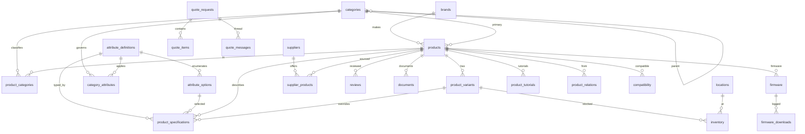

# Product Data Model — Flexible Attribute System

> Supabase Postgres. Companion to [ARCHITECTURE.md](./ARCHITECTURE.md).
> Refines §6 of the architecture doc: the **normalized attribute rows are canonical**; the `products.specs` JSONB is a *generated projection* (see §1.3). This corrects the earlier "specs jsonb = canonical" note.

---

## 1. Design of the flexible attribute system

The core requirement — "Voltage: 5V, CPU: ESP32, Connectivity: WiFi + Bluetooth, Battery: 5000mAh" varying per product — rules out fixed columns. But the two naive flexible options both fail at catalog scale:

| Approach | Fails because |
|---|---|
| **Pure EAV** (one untyped value column) | No units, no type safety, no range filtering, no enum canonicalization → facets fragment ("WiFi"/"Wi-Fi"/"WIFI") |
| **Pure JSONB blob** | No schema, no validation, no per-category attribute governance, no unit normalization for numeric range filters |

### 1.1 The Digi-Key/Mouser model — three concepts, not one

We split the problem the way parametric distributors do:

1. **Attribute (definition)** — *what a spec is*: `Voltage`, unit `V`, type `number`, base unit `V`, filterable. Defined **once**, reused across products. → `attribute_definitions`
2. **Attribute options** — for enumerated attributes, the *canonical* allowed values (`WiFi`, `Bluetooth`, `Zigbee`, `LoRa`). Prevents facet fragmentation. → `attribute_options`
3. **Specification (value)** — *this product's value* for an attribute: this board's Voltage = 5V. → `product_specifications`

Plus governance: **which attributes apply to which category** (`category_attributes`), so a "Smartphone" surfaces different specs than an "Industrial Controller".

> **Attribute vs Specification** (both were requested): Attribute = the reusable *definition*; Specification = the *value* a product carries for it. This is the Digi-Key split.

### 1.2 Numeric normalization (the part most people get wrong)

A capacitor shown as `4.7 µF` must range-filter against `1 µF` and `10 nF`. You cannot filter on the display string. So every numeric value stores **both**:

- `value_num` + `unit` → human display magnitude (`4.7`, `µF`)
- `value_base` in the attribute's **base SI unit** → what filters/sorts actually compare (`4.7e-6` F)
- `value_display` → precomputed pretty string (`4.7 µF`, `-40 to 85 °C`) so the compare table and PDP never format client-side

Ranges (operating temp `-40…85 °C`) use `value_base` (low) + `value_base_high`.

### 1.3 Canonical store vs projections

- **Canonical:** the normalized rows (`attribute_definitions`, `attribute_options`, `product_specifications`). They carry types, units, options, and validation.
- **Projection A — `products.specs` JSONB:** a denormalized snapshot rebuilt by trigger/pipeline on spec change. Powers fast single-product reads and PDP render without N joins.
- **Projection B — Algolia record:** built by the Inngest pipeline; powers all storefront faceted filtering.

So Postgres indexes on the spec tables serve **admin, reporting, and reindex** — *not* high-QPS storefront filtering (Algolia does that). This keeps the relational design clean and the storefront fast.

---

## 2. Entity relationship overview



---

## 3. Catalog core

```sql
create extension if not exists ltree;
create extension if not exists pg_trgm;

-- BRAND -----------------------------------------------------------
create table brands (
  id           uuid primary key default gen_random_uuid(),
  slug         text not null unique,
  name         text not null,
  logo_url     text,                        -- Cloudinary
  website      text,
  description  text,                         -- short; rich copy lives in Sanity
  is_active    boolean not null default true,
  created_at   timestamptz not null default now()
);

-- CATEGORY (hierarchical, Digi-Key-style deep taxonomy) -----------
create table categories (
  id           uuid primary key default gen_random_uuid(),
  parent_id    uuid references categories(id) on delete restrict,
  slug         text not null unique,
  name         text not null,
  path         ltree not null,              -- e.g. root.dev_boards.mcu_boards
  depth        int  not null default 0,
  sort         int  not null default 0,
  icon_url     text,
  is_active    boolean not null default true
);

-- PRODUCT (mirror of Shopify + our catalog metadata) --------------
create type product_status as enum ('draft','active','archived','eol');
create type product_kind   as enum ('consumer','custom');

create table products (
  id                  uuid primary key default gen_random_uuid(),
  shopify_product_id  text unique,           -- gid://shopify/Product/... (null for quote-only custom)
  handle              text not null unique,
  title               text not null,
  subtitle            text,
  brand_id            uuid references brands(id),
  primary_category_id uuid references categories(id),
  kind                product_kind not null default 'consumer',
  status              product_status not null default 'draft',
  mpn                 text,                   -- manufacturer part number
  gtin                text,                   -- UPC/EAN
  short_description   text,                   -- body/rich content in Sanity
  hero_image_url      text,                   -- Cloudinary
  specs               jsonb not null default '{}',   -- GENERATED projection (see §1.3)
  is_quotable         boolean not null default false, -- custom devices -> quote flow
  rating_avg          numeric(2,1),           -- denormalized from reviews app
  rating_count        int not null default 0,
  published_at        timestamptz,
  synced_at           timestamptz,
  created_at          timestamptz not null default now(),
  updated_at          timestamptz not null default now()
);

-- secondary categories (a product lives in one primary + many facets)
create table product_categories (
  product_id  uuid references products(id) on delete cascade,
  category_id uuid references categories(id) on delete cascade,
  primary key (product_id, category_id)
);

-- VARIANT (mirror of Shopify variants) ----------------------------
create table product_variants (
  id                  uuid primary key default gen_random_uuid(),
  product_id          uuid not null references products(id) on delete cascade,
  shopify_variant_id  text unique,
  sku                 text not null,
  title               text,                  -- "256GB / Graphite"
  option_values       jsonb not null default '{}', -- {"Storage":"256GB","Color":"Graphite"}
  price_snapshot      numeric(12,2),         -- DISPLAY ONLY; Shopify authoritative
  currency            text default 'USD',
  weight_grams        int,
  barcode             text,
  position            int not null default 0,
  is_active           boolean not null default true
);
```

---

## 4. Flexible attribute system

```sql
create type attr_type as enum
  ('number','integer','enum','multi_enum','boolean','text','range');

-- ATTRIBUTE (reusable definition) ---------------------------------
create table attribute_definitions (
  id            uuid primary key default gen_random_uuid(),
  key           text not null unique,        -- 'voltage_supply', 'connectivity'
  name          text not null,               -- 'Supply Voltage'
  data_type     attr_type not null,
  unit          text,                         -- display unit 'V','mAh','µF'
  base_unit     text,                         -- SI base for filtering 'V','Ah','F'
  base_factor   numeric,                      -- value_base = value_num * base_factor
  description   text,
  is_filterable boolean not null default true,  -- becomes an Algolia facet
  is_comparable boolean not null default true,  -- shows in compare table
  is_key_spec   boolean not null default false, -- highlighted on cards/PDP header
  display_group text,                          -- 'Power','Connectivity','Processor'
  sort          int not null default 0,
  created_at    timestamptz not null default now()
);

-- ATTRIBUTE OPTIONS (canonical enum members -> no facet fragmentation)
create table attribute_options (
  id            uuid primary key default gen_random_uuid(),
  attribute_id  uuid not null references attribute_definitions(id) on delete cascade,
  value         text not null,               -- 'WiFi'
  label         text not null,               -- 'Wi-Fi 802.11 b/g/n'
  sort          int not null default 0,
  unique (attribute_id, value)
);

-- CATEGORY ⇄ ATTRIBUTE governance (which specs apply where) --------
create table category_attributes (
  category_id   uuid not null references categories(id) on delete cascade,
  attribute_id  uuid not null references attribute_definitions(id) on delete cascade,
  is_required   boolean not null default false,
  sort          int not null default 0,
  primary key (category_id, attribute_id)
);

-- SPECIFICATION (the value a product carries for an attribute) -----
create table product_specifications (
  id             uuid primary key default gen_random_uuid(),
  product_id     uuid not null references products(id) on delete cascade,
  variant_id     uuid references product_variants(id) on delete cascade, -- null = product-level
  attribute_id   uuid not null references attribute_definitions(id) on delete restrict,

  -- one of these value slots is used depending on data_type:
  value_num      numeric,        -- scalar / range low  (display magnitude)
  value_num_high numeric,        -- range high
  value_base     numeric,        -- normalized to base_unit  -> FILTER/SORT on this
  value_base_high numeric,
  unit           text,           -- snapshot of display unit
  value_option_id uuid references attribute_options(id), -- enum / multi_enum member
  value_bool     boolean,
  value_text     text,
  value_display  text not null,  -- precomputed '5 V', '-40 to 85 °C', 'Wi-Fi'

  source         text default 'manual',  -- manual|import|datasheet_parse
  created_at     timestamptz not null default now(),

  -- scalar attrs appear once per product/variant; multi_enum appears once per option.
  -- PG15+ NULLS NOT DISTINCT makes the nulls behave for the uniqueness we want.
  constraint uq_spec unique nulls not distinct
    (product_id, variant_id, attribute_id, value_option_id)
);
```

**How each `data_type` maps to the value slots**

| data_type | slots used | example |
|---|---|---|
| `number` | `value_num`, `unit`, `value_base`, `value_display` | Battery `5000 mAh` → num 5000, base 5 (Ah), display "5000 mAh" |
| `integer` | `value_num`, `value_display` | GPIO count `36` |
| `range` | `value_num`+`value_num_high` (+ base pair) | Operating temp `-40…85 °C` |
| `enum` | one row, `value_option_id`, `value_display` | Form factor `DIP` |
| `multi_enum` | **N rows**, one `value_option_id` each | Connectivity `WiFi`, `Bluetooth` |
| `boolean` | `value_bool`, `value_display` | RoHS `true` → "Yes" |
| `text` | `value_text`, `value_display` | CPU `ESP32-D0WD` |

---

## 5. Inventory & sourcing (the distributor angle)

```sql
create table locations (
  id      uuid primary key default gen_random_uuid(),
  code    text not null unique,             -- 'WH-US-EAST'
  name    text not null,
  country text
);

-- INVENTORY: Shopify authoritative for sellable qty; we add sourcing fields
create table inventory (
  variant_id     uuid not null references product_variants(id) on delete cascade,
  location_id    uuid not null references locations(id),
  quantity       int not null default 0,     -- mirror of Shopify available
  on_order       int not null default 0,
  reorder_point  int,
  lead_time_days int,                         -- for custom/industrial
  moq            int,                         -- minimum order qty
  updated_at     timestamptz not null default now(),
  primary key (variant_id, location_id)
);

-- SUPPLIER (for custom/industrial/embedded sourcing) --------------
create table suppliers (
  id           uuid primary key default gen_random_uuid(),
  name         text not null,
  code         text unique,
  contact_email text,
  lead_time_days int,
  is_active    boolean not null default true,
  created_at   timestamptz not null default now()
);

create table supplier_products (
  id             uuid primary key default gen_random_uuid(),
  supplier_id    uuid not null references suppliers(id) on delete cascade,
  product_id     uuid references products(id) on delete set null,
  variant_id     uuid references product_variants(id) on delete set null,
  supplier_sku   text not null,
  mfr_part_number text,
  unit_cost      numeric(12,4),
  currency       text default 'USD',
  moq            int,
  pack_qty       int,
  lead_time_days int,
  is_preferred   boolean not null default false,
  updated_at     timestamptz not null default now(),
  unique (supplier_id, supplier_sku)
);
```

---

## 6. Content, support & lifecycle

```sql
-- REVIEW: canonical in reviews app (Judge.me/Okendo). This is the
-- queryable/SEO mirror; rating_avg/count denormalized onto products.
create type review_status as enum ('pending','published','rejected','spam');
create table reviews (
  id            uuid primary key default gen_random_uuid(),
  external_id   text unique,                 -- id in reviews app
  product_id    uuid not null references products(id) on delete cascade,
  user_id       uuid,                         -- app user if known (RLS)
  author_name   text,
  rating        int not null check (rating between 1 and 5),
  title         text,
  body          text,
  is_verified   boolean not null default false,
  status        review_status not null default 'pending',
  helpful_count int not null default 0,
  created_at    timestamptz not null default now()
);

-- DOCUMENTATION (manuals, datasheets, certs, CAD) -----------------
create type doc_type as enum ('manual','datasheet','certificate','cad','guide','schematic');
create table documents (
  id           uuid primary key default gen_random_uuid(),
  product_id   uuid not null references products(id) on delete cascade,
  doc_type     doc_type not null,
  title        text not null,
  url          text not null,               -- Cloudinary (public) / Storage (gated)
  language     text default 'en',
  version      text,
  size_bytes   bigint,
  is_public    boolean not null default true,
  sanity_ref   text,                         -- if body authored in Sanity
  published_at timestamptz,
  created_at   timestamptz not null default now()
);

-- FIRMWARE --------------------------------------------------------
create type fw_channel as enum ('stable','beta','dev');
create table firmware (
  id                  uuid primary key default gen_random_uuid(),
  product_id          uuid not null references products(id) on delete cascade,
  version             text not null,          -- 'v2.3.1'
  semver              text,                    -- '2.3.1' for sorting
  channel             fw_channel not null default 'stable',
  storage_path        text not null,          -- Supabase Storage (private)
  checksum_sha256     text not null,
  size_bytes          bigint,
  min_hardware_rev    text,
  requires_entitlement boolean not null default false,
  release_notes_ref   text,                    -- Sanity/markdown
  is_public           boolean not null default true,
  published_at        timestamptz,
  created_at          timestamptz not null default now(),
  unique (product_id, version, channel)
);

create table firmware_downloads (           -- audit; append-only, BRIN-friendly
  id          bigint generated always as identity primary key,
  firmware_id uuid not null references firmware(id) on delete cascade,
  user_id     uuid,
  ip          inet,
  at          timestamptz not null default now()
);

-- device registration -> firmware entitlement
create table device_ownership (
  user_id      uuid not null,
  product_id   uuid not null references products(id) on delete cascade,
  serial       text,
  registered_at timestamptz not null default now(),
  primary key (user_id, product_id, serial)
);

-- TUTORIAL (authored in Sanity; this links products <-> content) --
create table product_tutorials (
  product_id  uuid not null references products(id) on delete cascade,
  sanity_id   text not null,                 -- Sanity document _id
  title       text not null,
  slug        text not null,
  level       text,                           -- beginner|intermediate|advanced
  sort        int not null default 0,
  primary key (product_id, sanity_id)
);
```

---

## 7. Relationships & compatibility

```sql
create type relation_type as enum
  ('accessory','compatible','alternative','upgrade','replacement','frequently_bought','bundle');

create table product_relations (
  from_product  uuid not null references products(id) on delete cascade,
  to_product    uuid not null references products(id) on delete cascade,
  relation_type relation_type not null,
  weight        numeric not null default 1,   -- ranking hint for recommendations
  note          text,
  primary key (from_product, to_product, relation_type)
);

-- COMPATIBILITY with products OR named platforms/standards
-- (e.g. "works with ESP32", "Zigbee 3.0", "Arduino", "5V logic")
create type compat_kind as enum ('product','platform','standard','protocol','ecosystem');
create table compatibility (
  id            uuid primary key default gen_random_uuid(),
  product_id    uuid not null references products(id) on delete cascade,
  target_kind   compat_kind not null,
  target_product_id uuid references products(id) on delete cascade,
  target_name   text,                          -- when not a catalog product
  notes         text,                          -- 'requires level shifter for 3.3V'
  verified      boolean not null default false,
  constraint compat_target_ck check (
    (target_kind = 'product' and target_product_id is not null) or
    (target_kind <> 'product' and target_name is not null)
  )
);
```

---

## 8. Quote requests (custom devices)

```sql
create type quote_status as enum ('new','reviewing','quoted','won','lost','cancelled');
create table quote_requests (
  id            uuid primary key default gen_random_uuid(),
  reference     text not null unique,          -- 'Q-2026-000482'
  user_id       uuid,                           -- nullable = guest; RLS scopes owner
  company       text,
  contact_name  text,
  contact_email text not null,
  phone         text,
  status        quote_status not null default 'new',
  target_date   date,
  budget_range  text,
  created_at    timestamptz not null default now(),
  updated_at    timestamptz not null default now()
);

create table quote_items (
  id            uuid primary key default gen_random_uuid(),
  quote_id      uuid not null references quote_requests(id) on delete cascade,
  product_id    uuid references products(id),  -- reference a catalog item, or null for bespoke
  description   text not null,
  quantity      int not null default 1,
  target_price  numeric(12,2),
  specs         jsonb not null default '{}',   -- freeform requested specs
  attachments   jsonb not null default '[]'    -- [{name,url}] Cloudinary/Storage
);

create table quote_messages (
  id         uuid primary key default gen_random_uuid(),
  quote_id   uuid not null references quote_requests(id) on delete cascade,
  author_id  uuid,
  is_staff   boolean not null default false,
  body       text not null,
  at         timestamptz not null default now()
);
```

---

## 9. Example records — an ESP32 dev board, end to end

```sql
-- brand & category
insert into brands (id, slug, name) values
  ('b1000000-0000-0000-0000-000000000001','espressif','Espressif');

insert into categories (id, parent_id, slug, name, path, depth) values
  ('c0000000-0000-0000-0000-000000000001', null, 'dev-boards','Development Boards','dev_boards',0),
  ('c0000000-0000-0000-0000-000000000002',
   'c0000000-0000-0000-0000-000000000001','mcu-boards','MCU Boards','dev_boards.mcu_boards',1);

-- product
insert into products (id, shopify_product_id, handle, title, brand_id,
                      primary_category_id, kind, status, mpn) values
  ('a0000000-0000-0000-0000-000000000001',
   'gid://shopify/Product/8801', 'esp32-devkit-v1','ESP32 DevKit V1',
   'b1000000-0000-0000-0000-000000000001',
   'c0000000-0000-0000-0000-000000000002','consumer','active','ESP32-DEVKITC-32D');

-- attribute definitions (reused across the whole catalog)
insert into attribute_definitions (id, key, name, data_type, unit, base_unit, base_factor,
                                    is_key_spec, display_group, sort) values
  ('d0000000-0000-0000-0000-000000000001','voltage_supply','Supply Voltage','number','V','V',1,      true, 'Power',      10),
  ('d0000000-0000-0000-0000-000000000002','cpu','CPU','text',null,null,null,                          true, 'Processor',  10),
  ('d0000000-0000-0000-0000-000000000003','connectivity','Connectivity','multi_enum',null,null,null,  true, 'Connectivity',10),
  ('d0000000-0000-0000-0000-000000000004','battery_capacity','Battery Capacity','number','mAh','Ah',0.001, true,'Power', 20),
  ('d0000000-0000-0000-0000-000000000005','op_temp','Operating Temp.','range','°C','°C',1,             false,'Environment',10);

-- canonical enum options for Connectivity
insert into attribute_options (id, attribute_id, value, label, sort) values
  ('e0000000-0000-0000-0000-000000000001','d0000000-0000-0000-0000-000000000003','WiFi','Wi-Fi 802.11 b/g/n',10),
  ('e0000000-0000-0000-0000-000000000002','d0000000-0000-0000-0000-000000000003','Bluetooth','Bluetooth 4.2 + BLE',20),
  ('e0000000-0000-0000-0000-000000000003','d0000000-0000-0000-0000-000000000003','Zigbee','Zigbee 3.0',30);

-- which attributes this category exposes
insert into category_attributes (category_id, attribute_id, sort) values
  ('c0000000-0000-0000-0000-000000000002','d0000000-0000-0000-0000-000000000001',10),
  ('c0000000-0000-0000-0000-000000000002','d0000000-0000-0000-0000-000000000002',20),
  ('c0000000-0000-0000-0000-000000000002','d0000000-0000-0000-0000-000000000003',30),
  ('c0000000-0000-0000-0000-000000000002','d0000000-0000-0000-0000-000000000005',40);

-- THE SPECIFICATIONS (values) for this product
insert into product_specifications
  (product_id, attribute_id, value_num, value_base, unit, value_display) values
  ('a0000000-0000-0000-0000-000000000001','d0000000-0000-0000-0000-000000000001', 5, 5, 'V', '5 V');

insert into product_specifications
  (product_id, attribute_id, value_text, value_display) values
  ('a0000000-0000-0000-0000-000000000001','d0000000-0000-0000-0000-000000000002','ESP32-D0WD','ESP32');

-- Connectivity = WiFi + Bluetooth  -> two rows (multi_enum)
insert into product_specifications
  (product_id, attribute_id, value_option_id, value_display) values
  ('a0000000-0000-0000-0000-000000000001','d0000000-0000-0000-0000-000000000003','e0000000-0000-0000-0000-000000000001','Wi-Fi'),
  ('a0000000-0000-0000-0000-000000000001','d0000000-0000-0000-0000-000000000003','e0000000-0000-0000-0000-000000000002','Bluetooth');

-- Operating temperature range -40..85 °C
insert into product_specifications
  (product_id, attribute_id, value_num, value_num_high, value_base, value_base_high, unit, value_display) values
  ('a0000000-0000-0000-0000-000000000001','d0000000-0000-0000-0000-000000000005',-40,85,-40,85,'°C','-40 to 85 °C');
```

**Resulting `products.specs` JSONB projection** (generated on write, consumed by PDP + Algolia):

```json
{
  "voltage_supply": { "display": "5 V", "num": 5, "base": 5, "unit": "V" },
  "cpu":            { "display": "ESP32", "text": "ESP32-D0WD" },
  "connectivity":   { "display": ["Wi-Fi","Bluetooth"], "values": ["WiFi","Bluetooth"] },
  "op_temp":        { "display": "-40 to 85 °C", "base": -40, "base_high": 85, "unit": "°C" }
}
```

**Corresponding Algolia facets** (built by Inngest): `voltage_supply=5` (numeric), `connectivity=["WiFi","Bluetooth"]` (filter-or), `op_temp` range `[-40,85]`, `brand="Espressif"`, hierarchical `categories.lvl1="Development Boards > MCU Boards"`.

---

## 10. Indexing strategy

```sql
-- Catalog
create index idx_products_brand        on products(brand_id);
create index idx_products_category     on products(primary_category_id);
create index idx_products_status       on products(status) where status = 'active';
create index idx_products_specs_gin    on products using gin (specs jsonb_path_ops);
create index idx_products_title_trgm   on products using gin (title gin_trgm_ops); -- admin search only
create index idx_prodcat_category      on product_categories(category_id);

-- Taxonomy
create index idx_categories_path_gist  on categories using gist (path);
create index idx_categories_parent     on categories(parent_id);

-- Variants & inventory
create index idx_variants_product      on product_variants(product_id);
create index idx_variants_sku          on product_variants(sku);
create index idx_inventory_updated     on inventory(updated_at);        -- sync deltas

-- Attribute system (serves ADMIN + REINDEX, not storefront QPS)
create index idx_spec_product          on product_specifications(product_id);
create index idx_spec_variant          on product_specifications(variant_id) where variant_id is not null;
create index idx_spec_attr_base        on product_specifications(attribute_id, value_base);       -- range filter/report
create index idx_spec_attr_option      on product_specifications(attribute_id, value_option_id)
                                          where value_option_id is not null;                       -- enum filter/report
create index idx_catattr_attr          on category_attributes(attribute_id);
create index idx_attropt_attr          on attribute_options(attribute_id);

-- Content / support
create index idx_reviews_product       on reviews(product_id, status);
create index idx_reviews_rating        on reviews(product_id, rating);
create index idx_documents_product     on documents(product_id, doc_type);
create index idx_firmware_product      on firmware(product_id, channel, published_at desc);
create index idx_fw_downloads_time     on firmware_downloads using brin (at);  -- append-only audit
create index idx_tutorials_product     on product_tutorials(product_id);

-- Relationships
create index idx_relations_from        on product_relations(from_product, relation_type);
create index idx_relations_to          on product_relations(to_product);
create index idx_compat_product        on compatibility(product_id);
create index idx_compat_target         on compatibility(target_product_id) where target_product_id is not null;

-- Sourcing
create index idx_supplier_products_prod on supplier_products(product_id);
create index idx_supplier_products_pref on supplier_products(product_id) where is_preferred;

-- Quotes
create index idx_quotes_user           on quote_requests(user_id);
create index idx_quotes_status         on quote_requests(status) where status in ('new','reviewing');
create index idx_quote_items_quote     on quote_items(quote_id);
```

### Indexing rationale

| Choice | Why |
|---|---|
| **GIN `jsonb_path_ops` on `products.specs`** | Fast containment queries on the projection for admin/exports; smaller/faster than default GIN |
| **GiST on `categories.path` (ltree)** | Subtree queries (`path <@ 'dev_boards'`) for category pages & breadcrumbs in O(log n) |
| **Composite `(attribute_id, value_base)`** | The parametric range query shape; base-unit column makes cross-unit filtering correct |
| **Partial indexes** (`where status='active'`, `where is_preferred`) | Smaller, hotter indexes — most queries only touch active/preferred rows |
| **BRIN on `firmware_downloads.at`** | Append-only time-series; BRIN is tiny vs btree and range-scans by time efficiently |
| **`pg_trgm` on `title`** | Admin/back-office fuzzy search only — **storefront search is Algolia**, deliberately not Postgres |

### Scaling notes
- Storefront faceting never hits these tables — **Algolia** does, so this schema is sized for authoring/reindex load, comfortable well past 100k SKUs.
- `firmware_downloads` and `reviews` are the growth tables → partition by month (`at`/`created_at`) when they cross ~10M rows.
- Connection access via **Supavisor transaction pooling**; `service_role` writes (sync/Inngest) only, storefront reads via anon key + RLS.
- The `products.specs` projection is rebuilt by an `AFTER INSERT/UPDATE/DELETE` trigger on `product_specifications` (or in the Inngest reindex step) — a single source of truth (the rows) with one derived cache.
```
