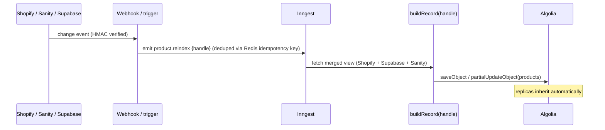

# Search Architecture (Algolia)

> Companion to [ARCHITECTURE.md](./ARCHITECTURE.md) §8, [DATA-MODEL.md](./DATA-MODEL.md), [FRONTEND.md](./FRONTEND.md).
> Algolia is a **derived read model** — never authored directly. Every record is assembled from Shopify + Supabase + Sanity by the Inngest pipeline.

The three example queries drive the design — each stresses a different capability:

| Query | What it needs |
|---|---|
| `ESP32 board` | chip/keyword in spec text + category token "board" |
| `5V temperature sensor` | **numeric spec token** (`5V`) + category ("temperature sensor") — no typo-fuzzing the number |
| `wireless security camera` | **synonym** (`wireless`→wifi/802.11) + category |

---

## 1. Index topology

One product per record (variants aggregated). Replicas for sort; separate indices for suggestions and editorial; Recommend models for merchandising.

```
products                       ← primary (relevance ranking)
├─ products_price_asc          ← virtual replica  (relevanceStrictness tuned)
├─ products_price_desc         ← virtual replica
├─ products_newest             ← virtual replica  desc(published_at)
└─ products_popularity         ← virtual replica  desc(popularity)

products_query_suggestions     ← Algolia Query Suggestions (autocomplete)
content                        ← tutorials/docs (Sanity) for federated search
Recommend models               ← related-products, frequently-bought, trending
```

**Why one record per product, not per variant:** at 10k SKUs the catalog stays small and fast, and electronics variants are *options* (storage/color), not distinct search targets. Variant data is **aggregated** onto the product record (min price, any-in-stock, option facets). *Switch to per-variant only if variant-level price/stock must be independently searchable — we isolate this in the record builder so it's a contained change.*

**Why virtual replicas (not standard):** virtual replicas keep relevance while applying a sort attribute, with `relevanceStrictness` controlling how hard the sort overrides relevance. Result: "sort by price low→high" doesn't float irrelevant cheap junk to the top — a classic ecommerce search failure we design out.

---

## 2. Record structure (the merged read model)

The flexible attribute system (DATA-MODEL §4) maps to Algolia as **two representations of specs**: searchable *text* for full-text recall, and typed *facets* for filtering. Each record carries only the spec keys it actually has — arbitrary keys per record is exactly what makes the parametric model work in Algolia.

```jsonc
// one products record — ESP32 DevKit V1
{
  "objectID": "a0000000-…-0001",            // = product id
  "handle": "esp32-devkit-v1",
  "url": "/products/esp32-devkit-v1",
  "title": "ESP32 DevKit V1",
  "brand": "Espressif",
  "mpn": "ESP32-DEVKITC-32D",
  "sku": "ESP32-DEVKIT-V1",
  "description": "ESP32 dev board, Wi-Fi + Bluetooth, 5V, -40 to 85 °C.",
  "image": "https://res.cloudinary.com/.../esp32.jpg",
  "kind": "consumer",
  "is_quotable": false,

  // hierarchical category (from ltree path) → HierarchicalMenu
  "categories": {
    "lvl0": "Development Boards",
    "lvl1": "Development Boards > MCU Boards"
  },

  // commerce (Shopify) — aggregated over variants
  "price": 12.90,
  "price_min": 12.90, "price_max": 14.50,
  "currency": "USD",
  "on_sale": false,
  "in_stock": true,
  "in_stock_rank": 1,                        // 1 in-stock / 0 out — for custom ranking
  "quantity_bucket": "1000+",
  "lead_time_days": 0,

  // social proof (reviews mirror)
  "rating": 4.7, "rating_count": 128,

  // ranking signal (PostHog batch)
  "popularity": 8421,

  // SPEC REPRESENTATION 1: searchable text (recall)
  "specs_text": "ESP32 ESP32-D0WD Wi-Fi WiFi Bluetooth BLE 5V 5 V 3.3V 5000mAh",

  // SPEC REPRESENTATION 2: typed facets (filtering) — only keys this product has
  "specs": {
    "voltage_supply": 5,                     // number → RangeInput
    "connectivity": ["WiFi", "Bluetooth"],   // multi_enum → RefinementList (OR)
    "cpu": "ESP32",                          // enum/text → RefinementList
    "op_temp_min": -40, "op_temp_max": 85    // range → dual numeric
  },

  "_tags": ["new", "staff-pick"],            // merchandising
  "published": true                          // secured-key filter (drafts/B2B hidden)
}
```

> **Numeric normalization carries over:** `specs.voltage_supply` holds the **base-unit** value from `product_specifications.value_base` (DATA-MODEL §1.2), so `5V` filters correctly against `3.3V` and `12V` regardless of display unit.

---

## 3. Searchable attributes (attribute-level ranking)

Order = priority. Part numbers rank high because technical buyers search them.

```js
searchableAttributes: [
  'title',
  'unordered(brand)',
  'unordered(mpn,sku)',      // exact part-number hits — critical for Digi-Key-style search
  'specs_text',              // "ESP32", "5V", "Wi-Fi", "Bluetooth"
  'categories.lvl0',
  'categories.lvl1',
  'unordered(description)',
]
```
- `unordered()` on brand/mpn/description → position in the field doesn't matter (a part number is a part number wherever it sits).
- `title` first (ordered) so leading words weigh most.
- `specs_text` above description → a query like `5V temperature sensor` matches spec tokens before prose.

---

## 4. Facets & filters

```js
attributesForFaceting: [
  'searchable(brand)',                 // high-cardinality → searchable facet
  'searchable(categories.lvl0)',
  'searchable(categories.lvl1)',
  'on_sale', 'in_stock', 'rating',
  'kind', 'filterOnly(published)',     // published = security filter only, never shown

  // parametric facets (union of filterable attribute_definitions)
  'specs.voltage_supply',
  'searchable(specs.connectivity)',
  'searchable(specs.cpu)',
  'specs.op_temp_min', 'specs.op_temp_max',
  // …extended by the reindex job from attribute_definitions where is_filterable
]
```

- **Numeric attributes** (`specs.voltage_supply`, temp) → `RangeInput`/slider, `numericFilters`.
- **Enum/multi-enum** (`specs.connectivity`, `cpu`, `brand`) → `RefinementList` (OR within, AND across).
- **Hierarchical** `categories.lvlN` → `HierarchicalMenu` (the ltree taxonomy).
- **`filterOnly(published)`** enforced via secured API key — drafts/EOL/B2B-only never leak to anonymous users.
- **Which facets show is dynamic** — see §7 `facetOrdering`/DynamicWidgets: an `ESP32 board` query surfaces voltage/connectivity/CPU; a `camera` query surfaces resolution/field-of-view. The facet set follows the result set, exactly like Digi-Key.

---

## 5. Ranking strategy

### Tie-breaking ranking (default order, kept)
`typo → words → filters → proximity → attribute → exact → custom`

### Custom ranking (business signals, applied at the `custom` tier)
```js
customRanking: [
  'desc(in_stock_rank)',   // in-stock beats out-of-stock at equal relevance
  'desc(popularity)',      // PostHog-derived demand
  'desc(rating_count)',    // trusted (many reviews) over lightly-reviewed
  'desc(rating)',
]
```

### Replicas / sort
```js
// products_price_asc (virtual replica)
{ customRanking: ['asc(price)'], relevanceStrictness: 60 }  // keep some relevance
// products_newest
{ customRanking: ['desc(published_at)'], relevanceStrictness: 75 }
```

### Typo tolerance (with the critical numeric exception)
```js
typoTolerance: true,
minWordSizefor1Typo: 4,
minWordSizefor2Typos: 8,
allowTyposOnNumericTokens: false,   // ← do NOT fuzz "5V", MPNs, "4.7uF"
ignorePlurals: true,
removeStopWords: ['en'],
```
`allowTyposOnNumericTokens: false` is the difference between `5V` matching 5-volt parts and it silently matching `6V`/`50V`. Non-negotiable for electronics.

### Synonyms (handles the example queries)
```
wireless        ⇄ wifi, wi-fi, 802.11            (multi-way)
bluetooth        → bt, ble                         (one-way abbrev)
temperature      → temp
esp32            → esp-32, esp 32
camera           → cam
microcontroller  → mcu, µC
```
So `wireless security camera` reaches Wi-Fi cameras; `5V temperature sensor` reaches `temp`-tokened sensors; `ESP32 board` tolerates `esp-32`.

### Query Rules (merchandising & query understanding — no deploys)
- **Promote/pin:** boost `staff-pick`, pin sponsored, bury `status:eol`.
- **Query→filter:** rule detects a voltage token in the query and adds a `specs.voltage_supply` filter (turns `5V …` into a real numeric filter, not just text match).
- **Contextual:** category landing pages pass `ruleContexts` to bias results.
- **Redirects:** `datasheet` / bare brand queries can redirect to the brand/doc hub.

---

## 6. Autocomplete

**Algolia Query Suggestions** index + the **Autocomplete** library, federated multi-source dropdown:

```
┌ Search "esp32" ─────────────────────────┐
│ RECENT       esp32 board                 │  ← recent searches (local)
│ SUGGESTIONS  esp32 dev board             │  ← products_query_suggestions
│              esp32 camera                │
│ PRODUCTS     [img] ESP32 DevKit  $12.90 ●│  ← products index, top 4, w/ price+stock
│              [img] ESP32-CAM     $9.50  ●│
│ CATEGORIES   Development Boards ›        │  ← categories facet
│ BRANDS       Espressif                   │
│ LEARN        "Getting started w/ ESP32"  │  ← content index (Sanity)
└──────────────────────────────────────────┘
```

- Suggestions index built by Algolia from real query analytics (popularity-ranked), refreshed nightly.
- Product hits show image + price + stock dot → users convert straight from the dropdown.
- Debounced, keyboard-navigable, `aria-live` announced (FRONTEND §10).

---

## 7. Frontend search components

**React InstantSearch v7** + **Autocomplete**, SSR-first for `/search` and `/c/[...category]` (crawlable first paint), then client refine — matches the `SearchExperience` island in FRONTEND.md.

```tsx
// SSR shell (Server Component) → getServerState for SEO + instant paint
const serverState = await getServerState(<SearchExperience />, { renderToString });

// SearchExperience (client island)
<InstantSearchNext searchClient={client} indexName="products" future={{ preserveSharedStateOnUnmount: true }}>
  <Configure hitsPerPage={24} filters="published:true" />
  <Autocomplete />                     {/* federated suggestions (§6) */}
  <div className="grid lg:grid-cols-[280px_1fr]">
    <aside>                            {/* FilterRail / FacetBottomSheet on mobile */}
      <DynamicWidgets>                 {/* facets follow the result set (facetOrdering) */}
        <HierarchicalMenu attributes={['categories.lvl0','categories.lvl1']} />
        <RefinementList attribute="brand" searchable />
        <RefinementList attribute="specs.connectivity" />
        <RangeInput attribute="specs.voltage_supply" />
        <RangeInput attribute="price" />
      </DynamicWidgets>
    </aside>
    <section>
      <div className="toolbar"><Stats /><CurrentRefinements /><SortBy items={SORTS} /><ClearRefinements /></div>
      <Hits hitComponent={ProductCard} />
      <Pagination />                   {/* or InfiniteHits on mobile */}
    </section>
  </div>
</InstantSearchNext>

const SORTS = [
  { label: 'Relevance',    value: 'products' },
  { label: 'Price ↑',      value: 'products_price_asc' },
  { label: 'Price ↓',      value: 'products_price_desc' },
  { label: 'Newest',       value: 'products_newest' },
  { label: 'Best sellers', value: 'products_popularity' },
];
```

- **`DynamicWidgets` + `renderingContent.facetOrdering`** → Algolia returns which facets matter for the current results, so the parametric facet rail adapts per query/category (Digi-Key behavior) without hand-mapping category→facets.
- **Secured API key** minted server-side (`/api/search/keys`) with `filters: published:true` (+ B2B scoping) and short TTL — the browser never holds a broadly-scoped key; the admin key never leaves the server.
- **URL routing** on InstantSearch → shareable, crawlable filtered URLs; deep facet permutations `noindex` + canonical to defeat duplicate content (FRONTEND §11).

---

## 8. Synchronization from Shopify / Sanity / Supabase

The record is assembled from all three sources, so **any** source change rebuilds the merged record — through the durable Inngest pipeline (ARCHITECTURE §4.1).



### Update tiers (avoid full re-index churn)
| Change | Method |
|---|---|
| Price / inventory (high frequency, Shopify) | `partialUpdateObject` — only `price*`, `in_stock*`, `quantity_bucket` |
| Spec / doc / category (Supabase) | rebuild record, `saveObject` |
| Story / short desc (Sanity) | rebuild `description`/content fields, `saveObject` |
| Popularity (PostHog) | nightly batch `partialUpdateObject` of `popularity` |
| Unpublish / archive / EOL | set `published:false` (kept for redirects) or `deleteObject` |

### Settings as code + full reindex
- **Index settings, synonyms, and Rules live in the repo** (`packages/search/settings.ts`) and deploy via CI — never hand-edited in the dashboard (reproducible, reviewable, environment-parity).
- **`attributesForFaceting` is generated** from `attribute_definitions where is_filterable` on each settings deploy, so adding a new filterable spec needs no code change.
- **Atomic full rebuild** (schema change or drift repair): index into `products_tmp` → `moveIndex` over `products` (zero-downtime swap). Run on a schedule as the **reconciliation job** that fixes any Shopify↔Supabase↔Algolia drift — the real correctness guarantee at scale (ARCHITECTURE §10).

### Content & Recommend
- **`content` index**: Sanity publish webhook → index tutorials/docs (title, excerpt, slug, product refs) for federated autocomplete + a "Learn" search tab.
- **Recommend**: models trained on the Algolia events (click/convert) + seeded by `product_relations` (DATA-MODEL §7) → power Accessories / Frequently-Bought / Alternatives rails (PDP §3).

---

## 9. Operational notes
- **Analytics → ranking loop:** Algolia Insights events (click/convert/add-to-cart) feed both Query Suggestions and Recommend, and inform `popularity`. Instrument via the same PostHog-tracked CTAs.
- **A/B testing:** Algolia A/B tests on ranking/relevanceStrictness; gate front-end variants with PostHog flags.
- **Guardrails:** `allowTyposOnNumericTokens:false`, secured keys, settings-as-code, atomic reindex — these four prevent the most common electronics-search failures (wrong-voltage matches, leaked drafts, dashboard drift, downtime).
- **Scale:** 10k records is trivial for Algolia; this design is unchanged to millions — the binding constraints are sync correctness (Inngest + reconciliation) and relevance tuning, not size.
```
